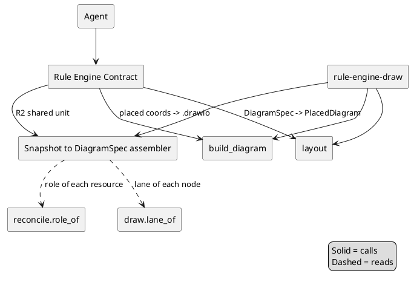

# Design Document

## Overview

The Contract's diagram path is re-pointed from the low-level
`diagram_layout.build_diagram()` node-set emitter to the same pipeline the
`rule-engine-draw` autogenerator uses: assemble a coordinate-free `DiagramSpec`,
run it through `layout()` to obtain a `PlacedDiagram`, then serialize with
`build_diagram()` using the placed coordinates. The Snapshot → `DiagramSpec`
assembly that `draw.py` already implements (role-resolve via `reconcile.role_of`,
lane via `draw.lane_of`) is extracted into one shared, importable unit so the
Contract and the autogenerator cannot drift. No new geometry type is introduced;
no lint rule, gate, or raster budget changes.

This design satisfies Requirements 1–4: it removes hand-authored coordinates from
the Contract (R1), shares one assembler (R2), keeps determinism and golden parity
(R3), and records the decision on the legacy path (R4).

## Architecture

The Contract keeps its existing responsibilities (validate inputs, orchestrate,
lint before returning, fail-closed) and changes only the *diagram construction*
step from "emit resolved nodes at caller coordinates" to "assemble a
`DiagramSpec`, place/route via `layout()`, serialize via `build_diagram()`".

The autogenerator and the Contract converge on one assembler and one
place/route/serialize pipeline; the only difference is the Contract's additional
input validation and lint-before-return orchestration.

## Components and Interfaces

### Snapshot → DiagramSpec assembler (shared, R2)

- **Responsibility:** turn a committed Snapshot (or the Contract's validated
  in-memory resource set) into a coordinate-free `DiagramSpec` — role-resolve
  every enumerated resource, assign a lane, and connect per the declared
  relationships (or the flow ordering when none exist).
- **Inputs:** the Snapshot path or resource records; the provider profile; the
  diagram class (`flow` | `landscape`).
- **Outputs / Interface:**
  `assemble_spec(resources, profile, diagram_class) -> DiagramSpec`. This is the
  logic currently inside `draw.py`, lifted so both callers import it; `draw.py`
  becomes a thin caller of it.

### Rule Engine Contract (changed diagram step, R1)

- **Responsibility:** validate inputs, call the shared assembler, run `layout()`,
  serialize with `build_diagram()`, lint, and return the triple (or a blocking
  error).
- **Inputs:** `provider`, `boundary_id`, `region`, optional Snapshot.
- **Outputs / Interface:** unchanged public contract — the returned artifact map
  (`{"drawio": …, "drawio_png": …, "diagram_md": …}`) or `ContractGenerationError`.

### layout() and build_diagram() (unchanged)

- **Responsibility:** placement/routing (`layout()`) and serialization
  (`build_diagram()`) — reused verbatim, no signature change.

## Data Models

### DiagramSpec (reused, no change)

| Field | Type | Constraint / Notes |
| --- | --- | --- |
| `nodes` | `Sequence[NodeSpec]` | coordinate-free; lane assigned, no `x`/`y` |
| `edges` | `Sequence[EdgeSpec]` | source/target ids; no waypoints |
| `containers` | `Sequence[ContainerSpec]` | Boundary + Network Boundary |
| `diagram_class` | `"flow" \| "landscape"` | governs node-count severity |

No new model is added (mirrors the `provider-diagram-conventions` J decision).

## Correctness Properties

**Property 1: no caller coordinates**

For every diagram the Contract produces, every node `x`/`y` and edge waypoint in
the output `.drawio` equals the value assigned by `layout()` for the assembled
`DiagramSpec` — the Contract sets none itself.

**Validates: Requirements 1.2, 1.3**

**Property 2: assembler parity**

For every committed Snapshot `S` and diagram class `C`, the `DiagramSpec`
assembled by the Contract equals the `DiagramSpec` assembled by `rule-engine-draw`
for `(S, C)`.

**Validates: Requirements 2.1, 2.2**

**Property 3: determinism**

For every valid input `I`, two Contract runs on `I` produce byte-identical
`.drawio` output.

**Validates: Requirement 3.1**

**Property 4: lint-clean placement**

For every valid input `I`, the `.drawio` the Contract produces has zero CRITICAL
and zero ERROR findings under `diagram-lint.md`, including `edge-direction`,
`entry-thirds`, `node-overlap`, and `container-padding`.

**Validates: Requirements 1.4, 3.2**

## Testing Strategy

- Property tests for Properties 1–4 (hypothesis where inputs are generated;
  golden-parity where the corpus is fixed).
- A regression test asserting the shipped `examples/` corpus is unchanged after
  the Contract path is re-pointed (byte-identity of every committed `.drawio`),
  so the wiring is proven to be a no-op on existing goldens or its diffs are
  reviewed deliberately.
- Reuse the existing `test_reconcile_*` coverage to prove R2.3 (no silent
  omission on a landscape) still holds through the shared assembler.

## Requirements Traceability

| Requirement | Design section | Property |
| --- | --- | --- |
| 1.1–1.5 | Rule Engine Contract (changed diagram step) | 1, 4 |
| 2.1–2.3 | Snapshot → DiagramSpec assembler | 2 |
| 3.1–3.3 | layout()/build_diagram() reuse; Testing Strategy | 3, 4 |
| 4.1–4.3 | Overview; recorded in docs/REVIEW.md + docs/ARCHITECTURE.md | — |
