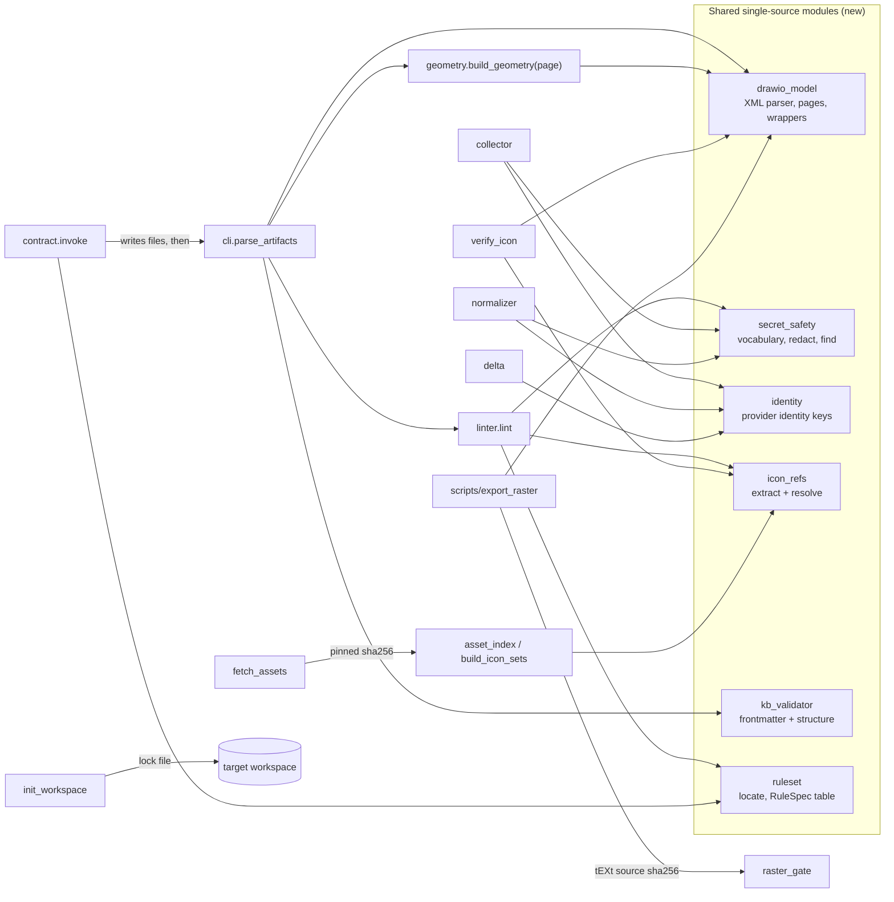

# Design Document

**Feature:** Honest Gates (release 1.7.0)

> Status: draft for review (2026-09-26). Based on `requirements.md` of the same
> spec and on the code at `fa68ebb` (1.6.1 + requirements draft). Requirement
> references use the form R*n*.*m* (Requirement *n*, criterion *m*).

## Overview

Every gate in 1.6.1 has at least one path where it prints "OK" without having
checked anything: the `.drawio` parser is a set of regexes that silently drops
geometry (`except Exception: geo = None` in `cli._parse_drawio`), `frontmatter`
tests presence only, `secret-safety` is a substring scan, the icon verifier
reports `skipped` for every OCI node, and `rule-engine-init --check` compares
file existence rather than content. 1.7.0 replaces each of these with a check
that either evaluates the artifact or blocks it.

The design follows three rules that apply to every component below:

1. **Parse or block.** Anything a gate cannot read becomes a Blocking_Finding
   (`parse-error`, `unverified` under `--strict`, a pin mismatch), never a skip.
2. **No silent zero.** A gate that evaluated zero items reports that as a
   failure where zero is implausible (no rasters found, no verified icon in a
   file with service vertices, no generator output to compare).
3. **One vocabulary, one module.** Every list that two components must agree on
   (secret markers, resource identity keys, resource types, icon manifests,
   ruleset location, rule severities) lives in exactly one module and is
   imported, never copied.

### Decisions adopted

The open decisions in `requirements.md` are not formally closed. This design
adopts each recommendation as a working assumption; each row names what would
change if the decision is overturned.

| # | Adopted | Design consequence | If overturned |
| --- | --- | --- | --- |
| D1 | draw.io is canonical; the `diagram-standards.md` format matrix is updated | `.drawio` is the only publishable diagram source. `--all` discovers `.puml`/`.mmd` and reports a `source-format` ERROR. The two PlantUML examples (`examples/cross-cloud/cross-cloud-composition.puml`, `examples/generic/generic-reference-architecture.puml`) are re-authored as `.drawio` triples in 1.7.0. | Add a PlantUML/Mermaid parser to `drawio_model`'s sibling and keep the `.puml` examples. |
| D2 | New and tightened checks ship at final severity | No transitional WARNING period. Every example is fixed in the same release (see Migration). | Add a one-release `RuleSpec.provisional` flag that downgrades the new rules to WARNING. |
| D3 | Keep the 1.6.1 bare-`key` rule with its `{Key, Value}` exemption and add a metadata-key allow-list | `secret_safety.METADATA_KEYS` exempts names such as `partition_key`, `sort_key`, `object_key`, `public_key`. | Drop the bare-`key` rule or treat it as always secret. |
| D4 | Extend the `resource_type` enum | The schema enum grows from 9 to 16 values; `constants.RESOURCE_TYPES` is the single source. | Add a separate `role` field and keep the enum at nine. |
| D5 | Exclude `inventory-*/00-MANIFEST.md` from the KB rule; `snapshot_gate` owns it | The Collector's table manifest stays as it is. The Linter still runs `secret-safety` on it. | Collector renders full KB frontmatter + four sections. |
| D6 | `requires-python = ">=3.11"` | CI matrix 3.11, 3.12, 3.13, 3.14. | 3.12 floor; drop one matrix row. |
| D7 | A command now, a scheduled CI job later | `rule-engine-build-icon-sets --update-pins`. No workflow change for pins in 1.7.0. | Add a scheduled workflow that runs the command and opens a PR. |

Two further items came out of the code investigation and need a decision:

- **D8 (new): flow rasters at scale ≥ 1.** R8.4 requires export at scale ≥ 1.
  Five flow examples have canvases wider than the 1600 px flow budget today and
  are currently downscaled: `aws/01` (1750 px), `aws/03` (1830), `azure/01`
  (1740), `gcp/01` (1800), `oci/01` (1800). At scale 1 the exporter rejects all
  five. Working assumption: tighten those layouts (pin the Flow/Legend block
  narrower, the sanctioned exception in `diagram-standards.md`) rather than
  raise the budget. The alternative is a flow budget of 1920 px.
- **D1 discrepancy.** The D1 rationale says "all examples are already draw.io";
  two are PlantUML. The conversion above is the cost of D1(a).

### Out of scope

As listed in `requirements.md` (snapshot → layout CLI, N-region layout,
steering trim, scored router). Additionally: the Contract's 1×1 PNG stub is
unchanged. The Contract output is not under `examples/`, so the raster gate
never sees it.

## Architecture



The central change is that **one parsed model feeds every consumer**. Today
`cli.py`, `geometry.py` and `verify_icon.py` each carry their own `_CELL_RE`
and `_attr` regexes, and `contract.py` lints a synthetic `Artifact` that never
touches a file. In 1.7.0:

- `drawio_model.parse_drawio()` is the only code that reads `.drawio` bytes.
- `cli.parse_artifacts()` turns each page into one `Artifact`;
  `geometry.build_geometry()` takes a `Page`, not text.
- `verify_icon` and the linter's `icon-resolved` rule share `icon_refs`.
- `contract.invoke` writes its files into a staging directory, lints them with
  `cli.parse_artifacts` + `linter.lint_with_ruleset`, and moves them into place
  only when every artifact is eligible.

### Module map

| Module | Status | Requirements |
| --- | --- | --- |
| `src/rule_engine/drawio_model.py` | new | R1.1–R1.9 |
| `src/rule_engine/cli.py` | changed: regex parser removed, `parse_artifacts`, discovery | R1, R2.8, R3.5, R10.3 |
| `src/rule_engine/geometry.py` | changed: `build_geometry(page)`, grid from page | R1.6, R1.7 |
| `src/rule_engine/linter.py` | changed: `RuleSpec` registry, findings with offenders, new rules | R1.8–R1.13, R2, R3, R4.5, R10.1 |
| `src/rule_engine/ruleset.py` | new: ruleset location + rule-table parser | R10.1, R10.2 |
| `src/rule_engine/kb_validator.py` | new | R2 |
| `src/rule_engine/secret_safety.py` | new; `constants.SECRET_*` become re-exports | R3 |
| `src/rule_engine/icon_refs.py` | new | R4 |
| `src/rule_engine/verify_icon.py` | changed: uses `drawio_model` + `icon_refs`, `--strict` | R4 |
| `src/rule_engine/diagram_layout.py` | changed: `OciStencilIcon` emits `ociSlug=` | R4.1 |
| `src/rule_engine/identity.py` | new | R5.3, R5.5, R5.8 |
| `src/rule_engine/collector.py`, `normalizer.py`, `delta.py`, `snapshot_gate.py` | changed | R3.6, R3.7, R5 |
| `schemas/inventory.schema.json`, `profiles/terminology.yaml`, `constants.py` | changed | R5.1, R5.2 |
| `src/rule_engine/fetch_assets.py`, `mappings/asset-sources.yaml` | changed | R6.1–R6.3 |
| `src/rule_engine/asset_index.py`, `build_icon_sets_cli.py` | changed | R6.4–R6.7, R4.1 |
| `src/rule_engine/init_workspace.py` | changed | R7 |
| `scripts/ha_multiregion_common.py` + 3 single-example generators | changed: `--check` | R8.1 |
| `scripts/export_raster.py`, `src/rule_engine/raster_gate.py` | changed | R8.2–R8.5 |
| `src/rule_engine/contract.py` | changed | R9 |
| `.github/workflows/ci.yml`, `pyproject.toml`, steering docs, `CHANGELOG.md` | changed | R4.3, R8.1, R10.4, R11 |

## Components and Interfaces

### 1. `drawio_model`: one XML parser for `.drawio` (R1.1–R1.9)

```python
@dataclass(frozen=True)
class Geom:
    x: float = 0.0            # missing coordinate -> 0 (R1.6)
    y: float = 0.0
    w: float = 0.0
    h: float = 0.0
    relative: bool = False
    points: tuple[tuple[float, float], ...] = ()   # only <Array as="points">
    source_point: tuple[float, float] | None = None
    target_point: tuple[float, float] | None = None

@dataclass(frozen=True)
class Cell:
    id: str
    parent: str
    label: str                 # decoded plain text, lines joined by "\n"
    style: str
    style_map: Mapping[str, str]
    vertex: bool
    edge: bool
    source: str | None
    target: str | None
    geom: Geom | None
    wrapper: str | None        # "UserObject" | "object" | None
    wrapper_attrs: Mapping[str, str]

    @property
    def lines(self) -> tuple[str, ...]: ...

@dataclass(frozen=True)
class Page:
    name: str                  # <diagram name>, else file stem
    id: str
    grid_size: int             # mxGraphModel@gridSize, else 10 (R1.7)
    cells: Mapping[str, Cell]  # insertion-ordered
    compressed: bool

class DrawioParseError(ValueError):
    path: str; page: str | None; cause: str

def parse_drawio(data: bytes | str, *, path: str) -> list[Page]: ...
def absolute_origin(page: Page, cell_id: str) -> tuple[float, float]: ...
```

**XML safety (R1.9).** The parser is built on `xml.parsers.expat` directly,
with a small tree builder (element, attributes, text, children). The
`StartDoctypeDeclHandler`, `EntityDeclHandler` and `ExternalEntityRefHandler`
raise `DrawioParseError("dtd-or-entity-declaration")`, and
`SetParamEntityParsing(XML_PARAM_ENTITY_PARSING_NEVER)` is set. This rejects
internal entity expansion (billion laughs) and external entities without
adding `defusedxml` as a dependency. The same guarded parse is used for the
decompressed inner model.

**Page extraction (R1.2, R1.3).** Accepted roots: `<mxfile>` with one or more
`<diagram>` children, or a bare `<mxGraphModel>` (one page named after the file
stem). For a `<diagram>` without an `<mxGraphModel>` child, its stripped text is
decoded as `urllib.parse.unquote(zlib.decompress(base64.b64decode(t), -15))` —
the same pipeline `fetch_assets._decode_drawio_payload` already uses, which
moves into `drawio_model.decode_compressed()` and is imported from there.
Duplicate page names are disambiguated as `name`, `name (2)`, … so the
`<file>#<page>` label is unique.

**Wrappers (R1.4).** A `UserObject` or `object` child of `<root>` that contains
exactly one `mxCell` yields one `Cell` whose `id` comes from the wrapper and
whose raw label comes from the wrapper's `label` attribute. Other wrapper
attributes (tooltips, custom properties, a `placeholders` flag) land in
`wrapper_attrs`. A wrapper with zero or several `mxCell` children is a
`DrawioParseError`.

**Labels (R1.5).** Expat already decodes XML entities (`&#10;`, `&amp;`). When
`style_map.get("html") == "1"`, the label is treated as HTML: `<br>`, `</div>`,
`</p>` and `</li>` become line breaks, remaining tags are stripped with an
`html.parser.HTMLParser` subclass (not a regex), and HTML entities
(`&nbsp;`, `&lt;`) are resolved with `html.unescape`. Each line is stripped of
surrounding whitespace. Non-HTML labels only split on `\n`.

**Styles.** `style_map` parses `key=value;` pairs; a bare leading token without
`=` (for example `text`, `group`, `ellipse`) is recorded as `{token: ""}` so
`"text" in style_map` is a structural test rather than a substring match.
`shape=stencil(...)` values are kept whole (the parser splits on `;` only
outside parentheses).

**Geometry (R1.6).** Waypoints come only from
`<mxGeometry><Array as="points"><mxPoint/>…</Array></mxGeometry>`. The pre-1.7
`_POINT_RE` in `geometry.py` also picked up `sourcePoint`/`targetPoint` and the
`offset` point of edge labels, which put phantom waypoints into routing checks.
Edge points are stored as authored; `geometry.build_geometry` adds
`absolute_origin(page, edge.parent)` so an edge parented to a container is
evaluated in page coordinates. `absolute_origin` detects parent cycles and
raises `DrawioParseError("parent-cycle:<id>")` instead of silently returning
`(0, 0)` as `geometry.origin` does today.

**Errors (R1.8).** `ExpatError`, `binascii.Error`, `zlib.error`,
`UnicodeDecodeError`, a missing `<root>`, a parent cycle, and a non-numeric
geometry attribute all raise `DrawioParseError` with a machine cause string.

### 2. CLI parsing and discovery (R1.3, R1.8, R1.10–R1.13, R2.8, R3.5, R10.3)

```python
def parse_artifacts(path: str) -> list[Artifact]: ...
def parse_artifact(path: str) -> Artifact: ...   # compat: single-page only
```

`parse_artifacts` is the primary entry point for the Lint_CLI, the Contract
and tests. `parse_artifact` is kept for existing callers: it returns the only
artifact of a single-page file and raises `ValueError("multi-page: use
parse_artifacts")` otherwise, so no caller silently lints just page one.

For a `.drawio`:

- `DrawioParseError` → one `Artifact(kind="diagram", parse_errors=[cause])`.
  The `parse-error` rule fires on it; every other rule is skipped because the
  artifact carries no model.
- Each page → one `Artifact` with `path=file`, `page=page.name`, and
  `label = f"{file}#{page.name}"` for multi-page files (plain `file` for a
  single page, so existing output and tests keep their shape).
- `geometry.build_geometry(page)` runs without a blanket `except`; an exception
  raised inside it is caught once in `parse_artifacts` and converted into
  `parse_errors=["geometry:<ExceptionType>:<message>"]` (R1.8).
- Node classification (top-level vertex, boundary container, text cell) uses
  `constants.is_boundary_container_style` / `is_text_cell_style` on
  `Cell.style`, as today, but over parsed cells.

**Structural Legend and title (R1.11, R1.12).**

- The Legend is the text cell whose first non-empty line, casefolded, equals
  `legend`. `has_legend` is true only if that cell exists; `legend_lines` holds
  its lines. The word "legend" elsewhere in the file (an id, a note) no longer
  counts. The same rule identifies the `Flow` cell (`flow_legend_lines`).
- The title cell is the text cell whose label matches the full title format:

  ```python
  TITLE_RE = re.compile(
      r"^(?P<provider>\S+) (?P<workload>.+?) — (?P<boundary>.+?) / "
      r"(?P<region>\S+) \| (?P<date>\d{4}-\d{2}-\d{2}) \| v(?P<n>[1-9]\d*)$"
  )
  ```

  `title-versioned` fires when no text cell matches or when `date` is not a
  real calendar date (`datetime.date.fromisoformat` raises). A `vN` token in an
  unrelated cell no longer satisfies the rule.
- Overlay markers come from `style_map["overlay"]` of each cell. A term is
  covered only when it appears as a whole token in `legend_lines` (R1.12). The
  pre-1.7 check (`text.lower().count(term) > 1`) counted the marker's own style
  occurrences.

**Edge endpoints (R1.10).** The CLI records, per edge, whether `source` and
`target` are set and whether each names an existing cell id. The new
`edge-endpoint` rule reports `missing-source`, `missing-target`,
`dangling-source:<id>` or `dangling-target:<id>`; severity WARNING for `flow`,
ERROR for `landscape`.

**Discovery (R2.8, R3.5, R10.3).**

| Path pattern | Artifact kind | Rules |
| --- | --- | --- |
| `*.drawio` | diagram (one per page) | all diagram rules |
| `*.puml`, `*.mmd` | diagram with `source_format` set | `source-format` ERROR (D1) |
| `*.md` passing `_is_kb_document` | document | `frontmatter` (keys + structure) |
| any UTF-8 text file under an `inventory-*` directory | snapshot, and additionally document when it is a KB `.md` | `secret-safety`; binary files → `parse-error` |
| other `*.json` whose content is a Normalized Resource | snapshot | `secret-safety` |

`_is_kb_document(path) = _is_generated_markdown(path) and not
_is_snapshot_manifest(path)`, where `_is_snapshot_manifest` is true for a file
named `00-MANIFEST.md` with an ancestor directory matching `inventory-*` (D5).
Steering, `SKILL.md` and the repository documents in `_EXCLUDED_MD_BASENAMES`
stay excluded. Manifests outside a snapshot folder (`examples/azure/00-MANIFEST.md`)
remain KB documents. `Artifact.in_snapshot: bool` marks any artifact inside an
`inventory-*` folder, so `secret-safety` applies to its text regardless of kind.

**Lint_CLI output (R1.13).**

```text
[BLOCKED] examples/aws/02-aws-ha-multiregion-landscape.drawio: edge-routing(ERROR), edge-float(ERROR)
    - ERROR edge-routing [e7, e12]: knee-through-rds-primary
    - ERROR edge-float [e19]: no-contact-points
```

`--json` prints the full result list. A finding never includes a secret value:
`secret-safety` offenders are JSON pointers or `line:<n>` locations only.

### 3. Linter rule registry and findings (R1.8, R1.13, R10.1, R10.2)

```python
@dataclass(frozen=True)
class RuleSpec:
    name: str
    default: Severity
    landscape: Severity | None = None        # class escalation, None = same
    reason_escalations: Mapping[str, Severity] = field(default_factory=dict)
    # reason prefix -> severity, e.g. {"knee-through-": ERROR, "pierces-target-": ERROR}

    def severity_for(self, diagram_class: str, reason: str = "") -> Severity: ...

@dataclass(frozen=True)
class RuleHit:
    offenders: tuple[str, ...] = ()
    reason: str = ""
    severity: Severity | None = None          # explicit override (node-count)

RULES: tuple[tuple[RuleSpec, Callable[[Artifact], RuleHit | list[RuleHit] | bool | Severity]], ...]
RULE_SEVERITIES: dict[str, Severity]          # derived: {spec.name: spec.default}
CLASS_ESCALATIONS: dict[str, Severity]        # derived: {name: spec.landscape}
```

- The per-predicate `if landscape: return Severity.ERROR` branches in
  `_check_container_padding`, `_check_edge_direction`, `_check_edge_float`,
  `_check_entry_thirds`, `_check_container_overlap` are replaced by
  `RuleSpec.landscape`; `edge-routing`'s crossing escalation becomes
  `reason_escalations`. The escalation is data that the sync test can read.
- Predicates return `RuleHit`s built from the offender lists the geometry
  checks already compute (they return ids and reasons today; `lint()` throws
  them away). `bool`/`Severity` returns stay accepted for programmatic callers.
- Finding shape: `{"rule", "severity", "offenders": [...], "reason": str}`. The
  first two keys are unchanged, so existing consumers keep working.
- New rules: `parse-error` (ERROR), `edge-endpoint` (WARNING, landscape ERROR),
  `source-format` (ERROR). Each gets a row in the `diagram-lint.md` rule table.

**`ruleset` module (R10.1, R10.2).** `find_ruleset` / `ruleset_available` move
here from `linter.py` (re-exported for compatibility) and gain one resolution
order used by both the Lint_CLI and the Contract:

1. `RULE_ENGINE_RULESET` when set (a set-but-missing path is **unavailable**,
   not a fallthrough);
2. `<workspace_root>/.kiro/steering/diagram-lint.md` when a workspace root is
   given, else `<cwd>/.kiro/steering/diagram-lint.md`;
3. the repository checkout that contains the package (`parents[2]`);
4. the bundled payload (`_bootstrap/kiro/steering/diagram-lint.md`).

`contract.invoke(..., workspace_root=None)` passes its argument through; the
Lint_CLI passes `--workspace-root` or `cwd`. Both call
`ruleset.require_ruleset(...)`, which returns the path or raises
`RulesetUnavailableError`; the CLI maps that to exit 2 and the Contract to
`ContractGenerationError`, both before any file is written.

`ruleset.parse_rule_table(text) -> dict[str, RuleRow]` reads the `## Lint
Rules` table (`rule`, `severity` cell such as `WARNING/ERROR`) and the
`## Diagram Class` escalation table. It exists for the sync test (R10.1) and is
not used at lint time: severities in code stay authoritative at runtime, the
test guarantees the document agrees.

### 4. `kb_validator`: frontmatter and document structure (R2)

```python
@dataclass(frozen=True)
class KbViolation:
    constraint: str        # e.g. "status-enum", "section-length", "h1-count"
    key: str | None        # frontmatter key or section name, when applicable
    detail: str            # human text, e.g. "Overview has 87 words (100-200)"

def split_frontmatter(text: str) -> tuple[str | None, str]     # BOM-tolerant
def load_frontmatter(block: str) -> tuple[dict | None, list[KbViolation]]
def validate_frontmatter(fm: Mapping) -> list[KbViolation]
def validate_structure(body: str) -> list[KbViolation]
def validate_document(text: str) -> list[KbViolation]
```

**YAML (R2.2, R2.5, R2.6).** `split_frontmatter` strips a leading `\ufeff`,
then matches `^---\r?\n(.*?)\r?\n---\r?\n?` (R2.6). `load_frontmatter` uses a
`_KbLoader(yaml.SafeLoader)` with the implicit `timestamp` resolver removed, so
`updated: 2026-02-30` stays the string `"2026-02-30"` instead of raising inside
the constructor or turning into a `datetime.date`. A `yaml.YAMLError` or a
non-mapping document yields `KbViolation("yaml-parse", None, <problem mark>)`.
`cli._parse_frontmatter_fallback` is deleted (R2.5). The companion-frontmatter
reader in `_parse_drawio` (`diagram_class`, `summary_of`) uses the same loader;
a companion that fails to parse makes the diagram artifact carry a
`parse-error` rather than defaulting to `flow`.

**Frontmatter constraints (R2.1–R2.3, R2.7).**

| Constraint | Condition |
| --- | --- |
| `missing-key:<k>` / `empty-key:<k>` | as in 1.6.1 (`related_docs: []` allowed) |
| `status-enum` | `status` not in `{"draft", "review", "published"}` |
| `date-format:<k>` | `updated` / `next_review_date` not a `str` matching `^\d{4}-\d{2}-\d{2}$`, or `date.fromisoformat` raises (rejects `2026-02-30`) |
| `list-type:<k>` | `tags` / `related_docs` not a YAML sequence |
| `tags-count` | `len(tags)` outside 1–20 |
| `related_docs-count` | `len(related_docs)` outside 0–20 |

**Structure constraints (R2.4).** Computed on the body after the frontmatter
with fenced code blocks (```` ``` ```` and `~~~`) masked out for heading, list
and table detection. Word counts use `re.findall(r"\S+", text)` over prose
outside fences, which matches how authors count and how the examples were
written.

| Constraint | Rule |
| --- | --- |
| `doc-length` | 300–2000 words (frontmatter excluded, fence contents excluded) |
| `section-missing:<S>` | no heading (level ≥ 2) whose text, casefolded, equals `S` for each of Overview, Main Content, Troubleshooting, See Also |
| `section-length:<S>` | words from the heading line (exclusive) to the next heading of the same or higher level: 100–200 |
| `h1-count` | exactly one ATX `# ` heading or Setext `===` heading |
| `list-depth` | a list item nested more than two levels (indent stack of `-`, `*`, `+`, `1.` markers) |
| `table-columns` | a GFM table whose delimiter row has more than five cells |
| `table-merged-cell` | a table row whose cell count differs from the delimiter row (GFM has no colspan; a short or long row is how a "merged" cell appears in source) |
| `anti-patterns-missing` | the body has a fenced block but no heading casefold-equal to `anti-patterns` |

**Integration.** `_check_frontmatter` returns one `RuleHit` per violation with
`reason = constraint` and `offenders = (key,)`, severity CRITICAL (the rule's
existing severity; kb-frontmatter AC 8.9/8.10 treat both classes as
rejection). Structural checks run only when `_is_kb_document` is true (R2.8);
the programmatic `Artifact(frontmatter=…)` path used by the Contract before
1.7.0 is gone (R9.4), so the validator always sees real text.

### 5. `secret_safety`: one vocabulary for Collector, Normalizer and Linter (R3)

```python
REDACTED = "[REDACTED]"

def normalize_key(name: str) -> str            # lowercase, drop [^a-z0-9]
CREDENTIAL_SUFFIXES: tuple[str, ...]           # normalized, matched as suffix
METADATA_KEYS: frozenset[str]                  # D3 allow-list, normalized
PAIR_NAME_KEYS, PAIR_VALUE_KEYS                # moved from collector

def is_credential_key(name: str) -> bool
def value_secret_kind(value: str) -> str | None     # "pem-private-key", "jwt", ...
def pair_redactions(mapping) -> tuple[frozenset, frozenset]   # moved from collector

@dataclass(frozen=True)
class SecretHit:
    location: str          # RFC 6901 JSON pointer, or "line:<n>"
    kind: str              # "credential-key:<normalized>", "value:<kind>", "pair:<name>"

def redact(obj: Any) -> Any                     # was collector.redact_secrets
def find_secrets(obj: Any) -> list[SecretHit]   # parsed JSON / YAML
def scan_text(text: str) -> list[SecretHit]     # non-JSON text files
```

**Key rule (R3.2, D3).** With `n = normalize_key(name)`:

- `n in METADATA_KEYS` → not secret;
- `n in {"key", "keys"}` → secret, except the `Key` field of a pure
  `{Key, Value}` record (the 1.6.1 passthrough, kept in `pair_redactions`);
- the raw name ends with `_key` or `-key` → secret unless `n in METADATA_KEYS`;
- `n` ends with any of `CREDENTIAL_SUFFIXES` → secret.

`CREDENTIAL_SUFFIXES` includes `password`, `passwd`, `secret`, `secretstring`,
`secretvalue`, `token`, `sessiontoken`, `accesstoken`, `refreshtoken`,
`clientsecret`, `accountkey`, `sharedaccesskey`, `primarykey`, `secondarykey`,
`primarymasterkey`, `secondarymasterkey`, `readonlymasterkey`, `adminkey`,
`connectionstring`, `privatekey`, `apikey`, `accesskey`, `secretaccesskey`,
`keymaterial`, `credential`, `credentials`. Suffix matching (instead of the
1.6.1 substring test) keeps `AccessKeyId`, `SecretArn`, `PasswordLastUsed`,
`privateKeyType` and `CustomerMasterKeySpec` as metadata (R3.4).
`METADATA_KEYS` holds names that end with a marker but are identifiers:
`publickey`, `sshpublickey`, `partitionkey`, `sortkey`, `hashkey`, `rangekey`,
`objectkey`, `s3key`, `keypairname` (list to be finalized with the examples).

A matched key counts as a leak only when its value is a non-empty string or
bytes that is not `REDACTED`. Booleans, numbers and `null` under a credential
key (`"PasswordEnabled": true`, `"hasSecret": false`) are metadata.

**Value shapes (R3.3).** `value_secret_kind` recognises, case-insensitively:
PEM/OpenSSH/PGP `PRIVATE KEY` blocks; `AccountKey=` / `SharedAccessKey=` /
`SharedAccessSignature=`; a SAS signature `[?&]sig=[^&\s]+`; a URL whose
userinfo has a password other than `REDACTED`; a JWT
(`eyJ[\w-]+\.eyJ[\w-]+\.[\w-]+`); the 1.6.1 inline assignments
(`password=…`, `AWS_SECRET_ACCESS_KEY=…`). An AWS key pair is detected at the
mapping level: a value matching `^(AKIA|ASIA)[A-Z0-9]{16}$` with a sibling
string value matching `^[A-Za-z0-9/+=]{40}$`. `-----BEGIN CERTIFICATE-----`,
`PUBLIC KEY` blocks and the bare label `SecureString` do not match (R3.4).
SecureString values are caught by the pair rule (`Type: SecureString` with a
non-redacted `Value`).

**Consumers.**

- `collector.redact_secrets` becomes `secret_safety.redact` (name kept as an
  alias). `_SECRET_KEY_MARKERS`, `_SECRET_CONTENT_RE`, `_PAIR_*` move out.
- `normalizer._is_secret_key` becomes `secret_safety.is_credential_key` for
  the digest drop list, and `_normalize_one` passes `tags` and the extracted
  string fields through `secret_safety.redact` before building the record
  (R3.7). A tag named `DB_PASSWORD` is written as `REDACTED`.
- `constants.SECRET_MARKERS` / `SECRET_CONTENT_MARKERS` are removed from the
  vocabulary; `constants` re-exports `secret_safety.CREDENTIAL_SUFFIXES` under
  the old names for one release with a `DeprecationWarning` on access.
- The linter's `_check_secret_safety` parses JSON and calls `find_secrets`
  (R3.1); for other text (`.md`, `.yaml`, `.txt`, `.csv`) it calls
  `scan_text`, which applies `value_secret_kind` per line and the key rule to
  `key: value` / `key=value` / `| key | value |` shapes (R3.5). A `.json` file
  in a snapshot that does not parse is scanned as text **and** gets a
  `parse-error`.

**Soundness link.** Because the Linter and the redactor share one predicate,
`find_secrets(redact(x)) == []` for every input, and any value the redactor
would change is reported by `find_secrets` before redaction. Both are
properties below.

### 6. `icon_refs` and the Icon_Verifier (R4)

```python
@dataclass(frozen=True)
class IconRef:
    cell_id: str
    kind: str      # resIcon | grIcon | azure2 | image | oci-slug | oci-glyph | generic-shape
    reference: str

@dataclass(frozen=True)
class IconSources:
    aws4: frozenset[str] | None            # mappings/aws4-icons.json
    azure2: frozenset[str] | None          # mappings/azure2-shapes.json
    oci_digests: Mapping[str, str] | None  # mappings/oci-stencil-digests.json (new)
    oci_stencils: frozenset[str] | None    # assets/vendor/oci-stencils/stencils.json
    generic_shapes: frozenset[str]         # from mappings/generic-icons.yaml
    workspace_root: Path

def load_sources(workspace_root: Path) -> IconSources
def service_vertices(page: Page) -> list[Cell]
def extract_refs(page: Page) -> dict[str, list[IconRef]]   # service cell id -> refs
def resolve(ref: IconRef, sources: IconSources) -> tuple[str, str]
# status in {"resolved", "unresolved", "skipped", "unverified"}
```

**OCI (R4.1).** `OciStencilIcon.__call__` adds `ociSlug=<slug>` to the
container group style (draw.io ignores unknown style keys). The verifier
resolves an `oci-slug` ref against `oci_stencils` when the pack is fetched,
else against `oci_digests`. `oci-glyph` refs are computed from the embedded
sub-cells: `sha256("\n".join(<shape=stencil(...) payloads in document order>))`.
When both refs are present the glyph digest must equal
`oci_digests[slug]`, so a marker cannot vouch for the wrong glyph. A glyph
without a marker is resolved by reverse lookup in `oci_digests`, which covers
hand-authored OCI diagrams. `mappings/oci-stencil-digests.json` holds hashes
only (no vendor content) and is written by `rule-engine-build-icon-sets` next
to `aws4-icons.json`; `--check` covers it.

**Unverified (R4.2).** A service vertex (top-level node that is neither a
boundary nor a text cell) with no ref at all, or only refs whose kind has no
verification source (`img/lib/*` outside azure2, `mxgraph.gcp2.*`, arbitrary
`shape=`), is reported as `unverified` with its cell id. Generic-profile nodes
resolve through `generic-shape` refs against the base shapes declared in
`mappings/generic-icons.yaml`.

**Path rule (R4.4).** An `image=` value is normalised with
`posixpath.normpath`. It is `unresolved` when it is absolute, contains `..`
after normalisation, does not start with `assets/`, or its suffix is not
`.svg`/`.png`; `data:` URIs are `unresolved` too. `img/lib/azure2/…` goes to the
azure2 manifest first.

**Exit codes (R4.3).**

| Condition | default | `--strict` |
| --- | --- | --- |
| any `unresolved` | 1 | 1 |
| any `unverified` | 0 (reported) | 1 |
| file has service vertices and zero `resolved` refs | 0 (reported) | 1 |
| I/O or `DrawioParseError` | 3 | 3 |

`skipped` (source not fetched) counts as not-verified for the third row, so a
GCP diagram checked without assets fails under `--strict` instead of passing on
zero checks. The CLI gains `--all` (walk `examples/` with the Lint_CLI's
discovery filters) so CI no longer needs the `find` loop; CI runs
`rule-engine-verify-icon --all --strict` after the asset fetch.

**Linter (R4.5).** `_check_icon_resolved` keeps the placeholder markers and
additionally calls `icon_refs.resolve` for `resIcon`, `grIcon`, `azure2` and
`oci-*` refs using committed manifests only. An unknown id is an ERROR with
the cell id as offender. File-path refs are left to the verifier because
assets may be absent at lint time.

### 7. Inventory: schema, identity, Collector, Delta (R5)

**Resource types (R5.1, D4).** `constants.py`:

```python
NEUTRAL_RESOURCE_TYPES = (...)             # the nine, unchanged
DIAGRAM_ROLE_TYPES = ("compute_instance", "file_system", "cdn", "dns", "waf", "lb", "cache")
RESOURCE_TYPES = NEUTRAL_RESOURCE_TYPES + DIAGRAM_ROLE_TYPES
```

`schemas/inventory.schema.json` `resource_type.enum` lists the sixteen values.
A test asserts `enum == RESOURCE_TYPES == set(roles.yaml roles)`.
`provider-profiles.md` and `inventory-standards.md` are updated: the nine rows
remain the terminology table, and a second table lists the seven role types
with their per-provider native labels.

**Terminology (R5.2).** `profiles/terminology.yaml` gains seven rows with a
label and aliases for aws, azure, gcp and oci, and a label for generic.
Examples of the aliases (final lists during implementation):

| Type | aws | azure | gcp | oci |
| --- | --- | --- | --- | --- |
| `compute_instance` | `AWS::EC2::Instance`, `aws_instance` | `Microsoft.Compute/virtualMachines` | `compute.googleapis.com/Instance`, `google_compute_instance` | `oci_core_instance` |
| `file_system` | `AWS::EFS::FileSystem`, `AWS::FSx::FileSystem` | `Microsoft.Storage/storageAccounts/fileServices` | `file.googleapis.com/Instance` | `oci_file_storage_file_system` |
| `dns` | `AWS::Route53::HostedZone` | `Microsoft.Network/dnsZones` | `dns.googleapis.com/ManagedZone` | `oci_dns_zone` |
| `lb` | `AWS::ElasticLoadBalancingV2::LoadBalancer` | `Microsoft.Network/loadBalancers` | `compute.googleapis.com/ForwardingRule` | `oci_load_balancer` |

**Identity module (R5.3, R5.5).**

```python
def flat(name: str) -> str                          # == secret_safety.normalize_key
IDENTITY_KEYS: Mapping[str, tuple[str, ...]]         # provider -> flat keys, priority order
def native_identity(resource: Mapping, provider: str) -> str | None
def content_identity(resource: Mapping) -> str       # "sha256:" + 12 hex of canonical JSON
```

`IDENTITY_KEYS["aws"]` starts with `arn`, `functionarn`, `loadbalancerarn`,
`topicarn`, `clusterarn`, `instanceid`, `filesystemid`, `dbinstanceidentifier`,
`dbclusteridentifier`, `cacheclusterid`, `replicationgroupid`, `queueurl`,
`vpcid`, `subnetid`, `id`; azure uses `id` (ARM id); gcp `selflink`, `id`; oci
`id`, `ocid`; generic `id`, `address` (Terraform state). Lookup compares
`flat(key)` so `InstanceId`, `instance_id` and `instanceId` match (R5.3).

- `normalizer._extract` builds `{flat(k): k}` once per resource and resolves
  every alias through it. `_FIELD_ALIASES` becomes flat names and `id` consults
  `identity.native_identity` first.
- `collector._resource_identity` becomes
  `native_identity(resource, provider) or resource name or content_identity(resource)`.
  The pre-1.7 `"resource"` fallback, which made every identity-less resource
  collide in one folder, is removed.

**Collector safety (R5.5–R5.7).**

```python
BOUNDARY_RE = re.compile(r"^[A-Za-z0-9._:-]+$")

class CollectorInputError(ValueError): ...

def _validate_target(root: Path, boundary_id: str, region: str, folder: str) -> Path
def _allocate_snapshot_dir(root: Path, folder: str) -> Path
def _resource_dirname(service: str, identity: str, taken: dict[str, str]) -> str
```

- `_validate_target` runs before any filesystem call and raises
  `CollectorInputError` when `boundary_id` or `region` fails `BOUNDARY_RE` or
  when `(root / folder).resolve()` is not inside `root.resolve()` (catches `..`
  which the regex allows through `.`).
- `_allocate_snapshot_dir` tries `folder`, then `folder-2`, `folder-3`, … with
  `Path.mkdir(exist_ok=False)`, so two concurrent runs cannot share a folder
  and an old snapshot is never merged into. `snapshot_gate._FOLDER_RE` and
  `inventory-standards.md` §3 accept an optional `-<n>` suffix (n ≥ 2).
- `_resource_dirname` returns `<slug(service)>-<slug(identity)>` truncated to
  100 characters. When that name is already taken by a different identity, or
  slugging was lossy, it appends `-<sha256(identity)[:8]>`. A second resource
  with the same identity in the same service is written under
  `-<sha256(identity + canonical json)[:8]>` and listed under `duplicates` in
  the manifest. No `write_text` ever targets an existing `resource.json`.

**Manifest (R5.4, D5).** The table rendering in `_render_manifest_md` stays;
`snapshot_gate.parse_manifest_fields` already reads it. The Lint_CLI no longer
applies the KB rule to it (section 2), so `rule-engine-lint` reports only
`secret-safety` on it and passes for a clean manifest. A test runs `collect()`
into `tmp_path` and asserts both `rule-engine-lint --all --workspace-root` and
`rule-engine-check-snapshot --strict` exit 0.

**Delta (R5.8).**

```python
@dataclass(frozen=True)
class Identity:
    provider: str; resource_type: str; boundary: str; region: str; identity_key: str

DUPLICATE = "duplicate"
CLASSIFICATIONS = (ADDED, CHANGED, REMOVED, UNCHANGED, DUPLICATE)
```

`_index_snapshot` returns `(index, duplicates)`; the `logger.warning` +
last-writer-wins branch is removed. `compute_delta` emits one `DeltaRecord`
with classification `duplicate` per identity that occurs more than once in
either snapshot (with `detail` naming the snapshot and the count) and does not
also classify that identity as added/changed/removed/unchanged, because either
answer would be a guess. `marker_for(DUPLICATE)` returns `""` (not drawn); the
versioned document lists duplicates in its Troubleshooting section. Missing
`boundary`/`region` in a snapshot entry is a `SnapshotInputError`, like a
missing `provider` today. The Contract's `except SnapshotInputError` fallback
that silently re-runs with no previous snapshot is replaced by a
`ContractGenerationError` naming the malformed input.

### 8. Pinned packs and a reproducible index (R6)

**Pins (R6.1).** Each provider in `mappings/asset-sources.yaml` gains:

```yaml
  aws:
    url: "https://…/Icon-package_07312026….zip"
    sha256: "<64 hex>"
    size: 123456789
```

**Fetcher (R6.1–R6.3).**

```python
class PackPinError(RuntimeError): provider, expected, actual
class InsecureURLError(RuntimeError): url

def _https_opener() -> urllib.request.OpenerDirector   # redirect handler rejects non-HTTPS
def _download_verified(url, pin, cache_dir) -> Path     # returns cache_dir/<sha256>.zip
def _unpack_fresh(zip_path, out_dir) -> int
```

- `_https_opener` installs an `HTTPRedirectHandler` subclass whose
  `redirect_request` raises `InsecureURLError` when the new URL's scheme is not
  `https`; the initial URL is checked the same way (R6.2).
- `_download_verified` streams into `tempfile.NamedTemporaryFile(dir=cache_dir,
  delete=False)`, hashing and counting as it writes; on a size or sha256
  mismatch the temp file is deleted and `PackPinError` raised; on success
  `os.replace(tmp, cache_dir / f"{sha256}.zip")` (R6.3). A cached `<sha>.zip`
  is re-hashed before reuse. The old `<key>.zip` cache names are ignored.
- `_unpack_fresh` extracts into `out_dir.with_name(f".{out_dir.name}.staging-<rand>")`
  with the existing zip-slip guard, then swaps it into place (rename old to
  `.old-<rand>`, `os.replace(staging, out_dir)`, remove old). Files from an
  earlier pack version can no longer survive in `out_dir` and reach the index.
- A provider without a pin is refused with a message pointing at
  `--update-pins`.

**Index (R6.4).** `build_icon_index` writes
`pack_summary[provider] = {"count": n, "sha256": pin.sha256}`; the digest is
taken from the verified pin, never recomputed from the unpacked tree.

**Update command (R6.5, D7).** `rule-engine-build-icon-sets --update-pins
[--only aws …]` downloads each pack over HTTPS without a pin, computes size and
sha256, rewrites only the `sha256:`/`size:` lines inside that provider's block
of `asset-sources.yaml` (line-level edit so comments survive; PyYAML cannot
round-trip them), then runs the normal fetch + index + manifest build. The
command prints old → new digests. Documented in `INSTALL.md` and
`asset-packs.md`.

**Slugs and ambiguity (R6.6, R6.7).** `_STRIP_TOKENS` loses `service`,
`cloud` and `public`. `index_provider` keeps, next to `best`, a map
`ambiguous: dict[slug, tuple[AssetEntry, ...]]` for slugs claimed by distinct
services (the case it only logs today). `resolve_asset` returns
`ResolvedAsset(source="unresolved", candidates=[…display names…])` when the
exact slug is ambiguous. `ResolvedAsset` gains `candidates: tuple[str, ...] = ()`.
Slug changes can move role resolutions, so `mappings/roles.yaml` queries are
re-checked and `icon-index.json` rebuilt; `--check` proves the goldens still
resolve to the same files.

### 9. `rule-engine-init` with a lock file (R7)

```json
{
  "lock_version": 1,
  "engine_version": "1.7.0",
  "source": "repo | bundle | power | explicit",
  "files": { ".kiro/steering/diagram-lint.md": "<sha256>", "...": "..." }
}
```

For each file under the bootstrap dirs, the command computes `src`
(source hash), `dst` (target hash, or absent) and `lock` (lock hash, or absent):

| State | Condition | Default run | `--force` |
| --- | --- | --- | --- |
| missing | `dst` absent | copy | copy |
| current | `dst == src` | keep | keep |
| stale | `dst == lock != src` | update | update |
| edited | `dst != lock` (or no lock and `dst != src`) | keep, report | back up, overwrite |
| extra | in target bootstrap dirs, not in source | keep, report | keep, report |

- `--check` reports all five groups and exits 1 when missing or stale is
  non-empty (R7.2). It resolves the target without `mkdir`; a non-existent
  target reports every file as missing (R7.5).
- A default run writes the lock after copying; an edited file keeps its old
  lock hash so it stays "edited" (R7.1, R7.3).
- `--force` copies each edited file to
  `.kiro/rule-engine-init-backup/<UTC YYYYmmddTHHMMSSZ>/<rel>` before
  overwriting (R7.4). The backup dir is outside `.kiro/steering`, so backups
  are never loaded as steering.
- A pre-1.7 workspace has no lock; the conservative "edited" reading means
  nothing is overwritten without `--force`.

**Writes stay in the target (R7.6).** `_fetch_assets_into` already passes the
target to `fetch_all`, but `build_icon_sets_cli.main` then refreshes
`azure2_shapes.DEFAULT_MANIFEST` / `AWS4_MANIFEST`, which resolve to the
engine's own `mappings/`. The builder gains `--manifests-dir` (default: the
directory of `--out`), and init passes `target/mappings`. A `_within(target,
path)` assertion guards every write path computed in init.

**Source resolution (R7.7).** `resolve_source` order becomes: explicit
`--source`; the repository checkout when `Path(__file__).parents[2]` holds
`pyproject.toml` with `name = "rule-engine"` and `.kiro/steering`; the bundled
payload; the Power repo. The lock records which was used.

### 10. Freshness of examples and rasters (R8)

**Generator `--check` (R8.1).** The eleven Generated_Examples come from seven
scripts: the four HA scripts (landscape + summary each, through
`ha_multiregion_common.run_cli`), `build_aws_infra_example.py`,
`build_gcp_example.py` and `build_oci_example.py`. Each gains `--check`: render
in memory, compare with the committed file byte for byte, print the first
differing line, exit 1 on a difference and 2 when an input asset (for example
`stencils.json` for OCI) is missing. Generators must be deterministic; any
`date.today()` in a title is replaced by the committed date constant. CI runs
all seven in the `validate` job after the asset fetch. The hand-authored
`aws/01`, `azure/01` and the two converted D1 diagrams have no generator and
are covered by lint and verifier only.

**Provenance chunk (R8.2).** After draw.io writes the PNG, the exporter
inserts a `tEXt` chunk before `IEND`:

```text
keyword: "rule-engine:source-sha256"
text:    sha256 of the exact .drawio bytes that were exported
```

The chunk is built with `struct` and `zlib.crc32` (stdlib). The raster gate
reads all chunks, recomputes the sha256 of the sibling `.drawio`, and reports
`stale-raster` (blocking) on a mismatch or a missing chunk.

**Raster checks (R8.3).** `raster_gate` reads IHDR width **and** height.
Height budget: the class width ceiling (flow 1600 px, landscape 3600 px), a new
row in the `diagram-standards.md` export table (value open for review). Opaque
white background: IHDR colour type must be 0 or 2 (no alpha channel) with no
`tRNS` chunk, and the first pixel row, which lies in the 8 px padding, must be
all `#FFFFFF`. Row 0 is reconstructed from its filter byte alone (the "Up" and
"Paeth" predictors refer to an all-zero previous row), so the check stays in
the stdlib and linear in one row. All current example PNGs are colour type 2.
No `.drawio` found under `--examples` is exit 2, not "OK" (R8.3).

**Export scale (R8.4, D8).** The exporter parses the page with `drawio_model`
and computes the natural canvas width `W` (union of all vertex boxes). The
scale is `clamp(target / W, 1, max_width / W)` with target 1600 (flow) or 3400
(landscape); when `W + 16 > max_width` the exporter exits 1 with
`"<file>: canvas <W>px exceeds the <class> budget at scale 1 — split the
diagram"` and writes no PNG. The draw.io call uses `--scale` instead of
`--width`.

**Exporter hygiene (R8.5).** `subprocess.run(..., timeout=180)`;
`TimeoutExpired` is a failure. The inlined temp copy goes to
`tempfile.mkdtemp(dir=REPO_ROOT / ".build-tools" / "export-tmp")` (still
readable by a snap-confined draw.io, never under `examples/`) and is removed in
`finally`. `inline_local_images` collects referenced assets that do not exist
and the exporter fails listing them instead of exporting a broken image.

### 11. The Contract lints what it writes (R9)

`invoke()` changes as follows:

1. `ruleset.require_ruleset(workspace_root)` before any file I/O (R10.2).
2. `_resolve_nodes` raises `ContractGenerationError("node-count", count,
   limit)` when the current snapshot has more resources than the class limit
   (12 for `flow`) instead of slicing `nodes[:12]` (R9.3).
3. `_render_drawio` emits only nodes. The consecutive "connects to" edges are
   removed (R9.2); the Contract has no relationship data, and drawing none is
   the honest output. The resulting `node-connectivity` WARNINGs are
   non-blocking. The Legend cell is rendered as lines (`Legend`, then one entry
   per line) so the structural Legend detection finds it, and the title cell
   uses the full title format.
4. All four outputs are written into `root / f".staging-{nn}-{uuid}"`, then
   `cli.parse_artifacts()` + `linter.lint_with_ruleset()` run over the staged
   `.drawio`, `.diagram.md` and `-existing-infrastructure.md` (R9.1, R9.4).
   `_frontmatter_dict` is deleted: the linted frontmatter is the one in the
   file. When every artifact is eligible the files are moved into `root` with
   `os.replace`; otherwise the staging dir is removed and
   `ContractGenerationError` lists each blocked file with its findings.
5. `related_docs` in the rendered companion documents lists the real sibling
   file names; the `"<provider>-<boundary>-related"` placeholder goes away.

### 12. Rule table sync, format matrix, Python versions (R10, R11)

- `tests/test_ruleset_sync.py` parses `.kiro/steering/diagram-lint.md` with
  `ruleset.parse_rule_table` and asserts, for every rule: it exists in `RULES`;
  its first severity equals `RuleSpec.default`; a `/ERROR` in the table matches
  a `landscape` or `reason_escalations` entry; the `## Diagram Class` table's
  escalated rules equal `CLASS_ESCALATIONS`. Rules in code but not in the table
  fail too (R10.1).
- `diagram-standards.md` "Source Format" matrix becomes: every diagram type →
  draw.io; Mermaid/PlantUML are not publishable sources in 1.7.0. The
  `mermaid-type` rule stays in the table for programmatic artifacts. `--all`
  discovers `.puml`/`.mmd` and reports `source-format` (R10.3, D1).
- `pyproject.toml`: `requires-python = ">=3.11"`, and the comment explaining the
  3.14 floor is rewritten (R11.1). `ci.yml` test matrix:
  `["3.11", "3.12", "3.13", "3.14"]` (R11.2). The code was not compiled on
  3.11–3.13 during this investigation (no interpreters available locally), so
  the matrix is the first real check; PEP 701 f-strings and 3.12+ stdlib calls
  are the likely breakages.

### CI pipeline after 1.7.0

| Job / step | Change |
| --- | --- |
| `test` | matrix 3.11–3.14 |
| `lint` | unchanged command; now sees `parse-error`, KB structure, `.puml` |
| `validate`: fetch | pinned; a pin mismatch fails the job (no `\|\| echo WARNING`) |
| `validate`: verify icons | `rule-engine-verify-icon --all --strict` |
| `validate`: generators | seven `--check` invocations |
| `validate`: rasters | provenance, height, background; exit 2 on zero sources |
| `validate`: init | adds `rule-engine-init --check` on a workspace with one edited file (must report edited, exit 0) |

## Data Models

### Lint finding (extended)

```json
{
  "rule": "edge-routing",
  "severity": "ERROR",
  "offenders": ["e7", "e12"],
  "reason": "knee-through-rds-primary"
}
```

`offenders` is a list of cell ids, KB keys or section names, JSON pointers, or
`line:<n>`; `reason` is a stable machine token. Lint result per artifact adds
`"label": "<file>#<page>"` and keeps `eligible_for_publication`.

### Artifact (new and changed fields)

| Field | Type | Purpose |
| --- | --- | --- |
| `page` | `str \| None` | page name for multi-page files |
| `label` | `str` | reporting label (`file` or `file#page`) |
| `parse_errors` | `list[str]` | non-empty → `parse-error`, other rules skipped |
| `grid_size` | `int` | from the page (R1.7) |
| `legend_lines` | `list[str] \| None` | structural Legend content |
| `edge_endpoints` | `list[tuple[str, str]]` | `(edge_id, reason)` for `edge-endpoint` |
| `in_snapshot` | `bool` | inside an `inventory-*` folder |
| `text` | `str \| None` | raw text for documents and snapshot files |
| `frontmatter` | kept | now produced by `kb_validator.load_frontmatter` |

### Normalized Resource

Unchanged shape; `resource_type.enum` grows to sixteen values. `tags` values
may be `"[REDACTED]"`.

### Delta record

`identity` gains `boundary` and `region`; `classification` may be
`"duplicate"` with `detail` = `"<snapshot>: <count> entries"`.

### Pack pin and index summary

`asset-sources.yaml` provider block: `sha256` (64 lowercase hex), `size`
(positive int). `icon-index.json` `pack_summary.<provider>`:
`{"count": int, "sha256": str}`. New committed
`mappings/oci-stencil-digests.json`: `{slug: sha256}`.

### Workspace lock file

See section 9. Paths are workspace-relative POSIX strings; hashes are sha256 of
file bytes.

### PNG provenance

`tEXt` chunk, keyword `rule-engine:source-sha256`, Latin-1 text of 64 hex
characters.

## Correctness Properties

*A property is a characteristic or behavior that should hold true across all valid executions of a system-essentially, a formal statement about what the system should do. Properties serve as the bridge between human-readable specifications and machine-verifiable correctness guarantees.*

Most of 1.7.0 is pure logic over parsed data (parsers, validators, redaction,
identity, classification, path and exit-code rules), so property-based testing
fits. Criteria that are configuration or CI wiring (R8.1, R10.1, R10.4, R11)
are smoke tests; path predicates and resolution orders with a handful of cases
(R2.8, R3.5, R5.1, R5.2, R7.5, R7.7, R10.3) are example tests. After
reflection, overlapping criteria are merged: the XML round trip covers
R1.1/1.2/1.4/1.5/1.7, and the redactor–linter agreement covers R3.6 together
with the soundness half of R3.4.

### Property 1: `.drawio` round trip

*For any* generated diagram model (pages, cells with random ids and parents,
optional `UserObject`/`object` wrappers, labels containing XML-special
characters, HTML line breaks and HTML entities, geometry with omitted
coordinates, any `gridSize` or none), serializing it to `.drawio` either
uncompressed or as a Compressed_Page and parsing it with `parse_drawio` yields
pages whose cells, decoded label lines, styles and geometry equal the model
(with omitted coordinates read as 0 and a missing `gridSize` read as 10).

**Validates: Requirements 1.1, 1.2, 1.4, 1.5, 1.7**

### Property 2: Waypoints are exactly the authored points in page coordinates

*For any* edge placed under a random chain of parent containers and given
random `<Array as="points">` waypoints plus random `sourcePoint`,
`targetPoint` and label-offset points, the edge geometry built by
`geometry.build_geometry` contains exactly the Array points, each translated by
the absolute origin of the edge's parent, and none of the other points.

**Validates: Requirements 1.6**

### Property 3: One artifact per page with unique labels

*For any* `.drawio` file with one or more pages (page names drawn with
duplicates allowed), `parse_artifacts` returns one artifact per page in
document order, and for files with more than one page every label has the form
`<file>#<page name>` and all labels are distinct.

**Validates: Requirements 1.3**

### Property 4: Parse or block

*For any* byte string derived from a valid `.drawio` file by truncation,
byte mutation, corrupting the base64/deflate payload of a compressed page, or
prepending a DOCTYPE or ENTITY declaration, the lint result either contains a
parsed model or contains a `parse-error` finding with severity ERROR and
`eligible_for_publication == False`; in particular, every input carrying a DTD
or entity declaration yields `parse-error`.

**Validates: Requirements 1.8, 1.9**

### Property 5: Broken edge endpoints are reported by class

*For any* valid diagram model and any subset of its edges whose `source` or
`target` is removed or replaced by an id not present in the page, the
`edge-endpoint` offenders equal that subset exactly, with severity ERROR when
the diagram class is `landscape` and WARNING when it is `flow`.

**Validates: Requirements 1.10**

### Property 6: Legend, title and overlay coverage are structural

*For any* diagram model, adding decoy occurrences of the word `legend`, `vN`
tokens or overlay terms to non-Legend cells (ids, notes, styles) does not
change `has_legend`, the detected title cell, or the `overlay-legend-coverage`
result; and for any set of overlay markers and Legend lines, the
`overlay-legend-coverage` offenders equal the markers that do not appear as a
token in a Legend line.

**Validates: Requirements 1.11, 1.12**

### Property 7: Every finding explains itself

*For any* artifact produced from a generated (valid or deliberately broken)
model, every finding in the lint result has a non-empty `reason`, and every
node, edge or container id listed in `offenders` exists in that artifact's
page.

**Validates: Requirements 1.13**

### Property 8: Frontmatter validation matches the contract

*For any* generated frontmatter mapping (valid values, or values drawn from
near-miss generators: statuses outside the enum, impossible dates such as
`2026-02-30`, non-padded dates, timestamps, lists of 0–25 entries, non-list
scalars, malformed YAML text), `validate_frontmatter` accepts it if and only if
every key satisfies the kb-frontmatter table, and every violation it returns
has a non-empty `constraint` that names the offending key where one applies.

**Validates: Requirements 2.1, 2.2, 2.3, 2.5, 2.7**

### Property 9: Structural validation matches a document model

*For any* document generated from a structure model (word count per section,
presence of the four required sections, number of H1 headings, maximum list
depth, table widths and row cell counts, presence of fenced code blocks and of
an Anti-patterns section), the set of `constraint` values returned by
`validate_structure` equals the set of violations computed from the model.

**Validates: Requirements 2.4**

### Property 10: A BOM does not change the verdict

*For any* Markdown document text `d`, `validate_document("\ufeff" + d)` equals
`validate_document(d)`.

**Validates: Requirements 2.6**

### Property 11: Planted secrets are found where they were planted

*For any* benign JSON value and any secret planted at a random position,
either as a string value under a credential key rendered in a random case and
separator style (camelCase, snake_case, kebab-case, upper case) or as a value
of a recognized shape (PEM private key, AWS key-id plus secret pair,
`AccountKey=`, `SharedAccessKey=`, SAS `sig=`, URL userinfo password, JWT)
under a benign key, `find_secrets` returns a hit whose location is the JSON
pointer of the planted value.

**Validates: Requirements 3.1, 3.2, 3.3**

### Property 12: Metadata is never reported

*For any* JSON value built only from benign generators (identifiers, ARNs,
regions, `privateKeyType`, `AccessKeyId`, `SecretArn`, `PasswordLastUsed`,
`Type: SecureString`, public certificate PEM blocks, booleans and numbers under
credential-looking keys, and the literal `[REDACTED]`), `find_secrets` returns
no hit.

**Validates: Requirements 3.4**

### Property 13: The redactor and the Linter agree

*For any* JSON value `x`, `find_secrets(redact(x))` is empty, and whenever
`redact(x) != x`, `find_secrets(x)` is non-empty.

**Validates: Requirements 3.6, 3.4**

### Property 14: Normalized resources carry no secrets

*For any* native resource whose tags or string fields contain planted secrets
(secret-named tag keys, secret-shaped values), the Normalized Resource returned
by `normalize` has `find_secrets(result) == []` and still validates against
the Inventory_Schema.

**Validates: Requirements 3.7**

### Property 15: Image paths outside the asset root are unresolved

*For any* `image=` reference string (absolute paths, paths with `..` segments
before or after normalisation, paths outside `assets/`, suffixes other than
`.svg`/`.png`, `data:` URIs), `icon_refs.resolve` returns `unresolved` whenever
the path escapes `assets/` or has a disallowed suffix.

**Validates: Requirements 4.4**

### Property 16: Linter and Icon_Verifier agree, and OCI glyphs are bound to their slug

*For any* reference drawn from the committed manifests or mutated from them
(`resIcon`, `grIcon`, azure2 path, OCI slug with or without a glyph digest, a
glyph whose stencil payload was altered), the Linter's `icon-resolved` rule
flags the cell if and only if the Icon_Verifier reports that reference as
`unresolved`, and an OCI node resolves only when its slug and glyph digest
match the same entry of the digest manifest.

**Validates: Requirements 4.1, 4.5**

### Property 17: Unverified vertices and strict exit codes

*For any* page whose service vertices carry random combinations of verifiable,
unverifiable and missing references, the verifier's `unverified` set equals
the service vertices with no verifiable reference; and for any report counts,
the exit code under `--strict` is non-zero exactly when there is an
unresolved or unverified reference or when the file has service vertices and
zero resolved references.

**Validates: Requirements 4.2, 4.3**

### Property 18: Normalization ignores key case and separators

*For any* native resource and any transformation that re-cases its keys or
swaps separators (`InstanceId`, `instance_id`, `instanceId`, `INSTANCE-ID`),
`normalize` returns the same Normalized Resource for the original and the
transformed input.

**Validates: Requirements 5.3**

### Property 19: The Collector loses nothing and passes its own gates

*For any* set of fake read-only enumerators returning resources with colliding
slugs, identical identities, PascalCase identity keys and no identity at all,
`collect()` writes one `resource.json` per returned resource with content equal
to the redacted resource, never writes two resources to one subfolder, and the
resulting snapshot passes `snapshot_gate.check_snapshot(strict)` and
`rule-engine-lint` with zero blocking findings.

**Validates: Requirements 5.4, 5.5**

### Property 20: Unsafe Collector inputs are refused before any write

*For any* `boundary_id` or `region` containing a character outside
`[A-Za-z0-9._:-]`, or forming a path that resolves outside `output_root`,
`collect()` raises `CollectorInputError` and `output_root` is byte-for-byte
unchanged afterwards.

**Validates: Requirements 5.6**

### Property 21: Repeated runs never merge snapshots

*For any* number k ≥ 1 of `collect()` runs with the same provider, boundary,
region and start timestamp, the runs produce k distinct snapshot folders,
every folder name passes the `folder-name` check, and the contents of earlier
folders are unchanged by later runs.

**Validates: Requirements 5.7**

### Property 22: Delta classification is a partition with explicit duplicates

*For any* pair of snapshots (resources may share ids across boundaries or
regions, and may repeat within one snapshot), `compute_delta` assigns exactly
one classification from `CLASSIFICATIONS` to each distinct
`(provider, resource_type, boundary, region, identity)` tuple, assigns
`duplicate` exactly to the tuples that occur more than once in either
snapshot, and treats resources that differ only in boundary or region as
distinct identities.

**Validates: Requirements 5.8**

### Property 23: Only pinned bytes over HTTPS are unpacked

*For any* payload bytes, pin (sha256, size) and redirect chain served by a fake
opener, the Fetcher unpacks the payload if and only if every URL in the chain
uses `https` and the payload's size and sha256 equal the pin; on any other
outcome no cache file named after a digest and no unpacked directory is
created.

**Validates: Requirements 6.1, 6.2, 6.3**

### Property 24: Unpacking yields exactly the current pack

*For any* two archives A and B unpacked in sequence into the same pack
directory, the directory afterwards contains exactly the entries of B, with
no file surviving from A.

**Validates: Requirements 6.3**

### Property 25: Pin rewriting preserves everything else

*For any* `asset-sources.yaml` text with comments and several providers, and
any new (sha256, size) values for a subset of providers, the pin updater's
output parses to the new values for those providers, the old values for the
others, and differs from the input only on the rewritten `sha256:`/`size:`
lines.

**Validates: Requirements 6.5**

### Property 26: Slugs keep meaningful words, ambiguity is never guessed

*For any* service name containing `service`, `cloud` or `public`, the slug
retains those words, so two names that differ only by them get different
slugs; and *for any* index in which two distinct services share an exact slug,
`resolve_asset` for that slug returns `unresolved` listing both services as
candidates.

**Validates: Requirements 6.6, 6.7**

### Property 27: `rule-engine-init` follows the lock-file state machine

*For any* generated source tree, target tree (with random deletions, edits,
extra files and engine-side changes) and lock file (present or absent),
`--check` reports the missing, edited, stale and extra sets predicted by the
state table and exits non-zero exactly when missing or stale is non-empty; a
default run leaves every edited file byte-identical, makes every missing and
stale file equal to the source, and writes a lock whose hashes match the
unedited files; and `--force` stores the previous bytes of every edited file
in the backup directory before overwriting it.

**Validates: Requirements 7.1, 7.2, 7.3, 7.4**

### Property 28: PNG provenance round trip

*For any* valid PNG and any 64-hex digest, inserting the
`rule-engine:source-sha256` chunk yields a PNG whose chunk CRCs are valid and
from which the Raster_Checker reads back the same digest; and the checker
reports `stale-raster` if and only if that digest differs from the sha256 of
the sibling `.drawio`.

**Validates: Requirements 8.2**

### Property 29: Raster verdicts follow the budget model

*For any* synthetic PNG (random width, height, colour type, presence of a
`tRNS` chunk, row-0 filter type and pixels) and diagram class, the
Raster_Checker blocks the raster if and only if the width or height exceeds
the class ceiling, the image has an alpha channel or transparency chunk, or
row 0 is not entirely `#FFFFFF`.

**Validates: Requirements 8.3**

### Property 30: Export scale is at least 1 or the export fails

*For any* natural canvas width W and diagram class, the exporter either
computes a scale s ≥ 1 with `W · s + 16 ≤` the class maximum width, or fails
with the split-the-diagram error, and it fails exactly when `W + 16` exceeds
the class maximum width.

**Validates: Requirements 8.4**

### Property 31: The Contract publishes only what the gate passed

*For any* generated inventory snapshot, `contract.invoke` either writes a set
of files on which `rule-engine-lint --file` reports no blocking finding and
whose `.drawio` contains no edge, or raises `ContractGenerationError` and
leaves the output root without any new file; and when the snapshot has more
resources than the class limit, the error names the count and the limit.

**Validates: Requirements 9.1, 9.2, 9.3**

### Property 32: One ruleset location for CLI and Contract

*For any* combination of `RULE_ENGINE_RULESET` (unset, pointing at a readable
file, pointing at a missing file), a workspace-root ruleset (present, absent,
empty) and a cwd ruleset (present, absent), the Lint_CLI and the Contract
resolve the same ruleset path, and when no readable ruleset is resolved both
block without writing any artifact.

**Validates: Requirements 10.2**

## Error Handling

| Condition | Component | Result | Blocking |
| --- | --- | --- | --- |
| Not XML, bad compressed page, parent cycle, wrapper with ≠ 1 `mxCell`, geometry exception | `drawio_model` / `cli` | `parse-error` finding naming file, page and cause; other rules skipped for that page | yes (ERROR) |
| DTD or entity declaration | `drawio_model` | `parse-error: dtd-or-entity-declaration` | yes |
| Companion `.diagram.md` frontmatter unparsable | `cli` | `parse-error` on the diagram (class cannot be known) | yes |
| Dangling or missing edge endpoint | `linter` | `edge-endpoint` | landscape only |
| `.puml` / `.mmd` found by `--all` | `cli` | `source-format` | yes |
| KB frontmatter YAML error or constraint violation | `kb_validator` | `frontmatter` finding per violation, naming key or constraint | yes (CRITICAL) |
| Secret in a snapshot file | `linter` | `secret-safety` with JSON pointer / line only, never the value | yes (CRITICAL) |
| Non-UTF-8 file in an `inventory-*` folder | `cli` | `parse-error: not-text` | yes |
| Unknown aws4/azure2/OCI reference | `linter`, `verify_icon` | `icon-resolved` ERROR / `unresolved` | yes |
| No verifiable reference | `verify_icon` | `unverified`; exit 1 under `--strict` | under `--strict` |
| Unsafe `boundary_id` / `region` / path | `collector` | `CollectorInputError` before any write | run refused |
| Duplicate identity | `collector`, `delta` | suffixed subfolder + manifest `duplicates`; `duplicate` delta record | no (visible) |
| Missing `boundary`/`region` in a snapshot entry | `delta` | `SnapshotInputError`; Contract raises `ContractGenerationError` | yes |
| Pin missing, size or sha256 mismatch, non-HTTPS URL or redirect | `fetch_assets` | `PackPinError` / `InsecureURLError`; temp file removed, nothing unpacked; CI job fails | yes |
| Ambiguous exact slug | `asset_index` | `unresolved` with candidates | caller decides |
| Stale or missing init file | `init_workspace --check` | listed; exit 1 | yes |
| Edited init file | `init_workspace` | listed, kept; backed up under `--force` | no |
| Write outside target during init | `init_workspace` | `AssertionError` from `_within`, exit 1 | yes |
| Generator output differs / input asset missing | generator `--check` | exit 1 / exit 2 with the path | yes |
| Raster provenance mismatch or missing, over height, alpha, non-white row 0 | `raster_gate` | named blocking line per raster | yes |
| No `.drawio` sources | `raster_gate` | exit 2 | yes |
| Canvas over budget at scale 1, draw.io timeout, missing asset | `export_raster` | exit 1, no PNG written | yes |
| Ruleset unavailable | `ruleset.require_ruleset` | CLI exit 2; Contract `ContractGenerationError` before writing | yes |
| Contract artifact blocked | `contract` | staging dir removed, `ContractGenerationError` lists files and findings | yes |

Principles: a finding names what failed and where (id, key, pointer, line),
never a secret value; a component that cannot evaluate an input says so with a
blocking result; the only non-blocking outcomes are those where the input was
fully evaluated and the issue is advisory.

## Testing Strategy

**Library and configuration.** Property tests use Hypothesis (already in the
`dev` extra). Each property test runs at least 100 examples
(`@settings(max_examples=100)` or a `hypothesis` profile in `conftest.py` with
`max_examples=100`, `deadline=None` for the filesystem-backed properties), and
each correctness property is implemented by a **single** property test tagged
with a comment:

```python
# Feature: honest-gates, Property 13: The redactor and the Linter agree
@settings(max_examples=100)
@given(json_values())
def test_redactor_and_linter_agree(x): ...
```

**Shared generators** (`tests/strategies.py`, new): diagram models and their
`.drawio` serializer (plain, compressed, wrapped, HTML labels); KB documents
from a structure model; JSON values with a plant-a-secret combinator and a
benign-metadata generator; native resources with key-case transforms; source
/target/lock trees for init; minimal PNG encoder (IHDR/IDAT/tEXt/IEND with
selectable colour type and filters). The serializer and PNG encoder are test
utilities, not production code.

**Property tests** (one per property, 32 total): files grouped by component —
`test_drawio_model_properties.py` (P1–P4), `test_linter_structure_properties.py`
(P5–P7), `test_kb_validator_properties.py` (P8–P10),
`test_secret_safety_properties.py` (P11–P14), `test_icon_refs_properties.py`
(P15–P17), `test_inventory_properties.py` (P18–P22),
`test_fetch_properties.py` (P23–P26), `test_init_properties.py` (P27),
`test_raster_properties.py` (P28–P30), `test_contract_properties.py` (P31),
`test_ruleset_properties.py` (P32). Network is never touched: the Fetcher takes
an injectable opener; init's asset step is monkeypatched.

**Example and edge-case tests** (kept small):

- a billion-laughs document and an external-entity document → `parse-error`;
- one real multi-page `.drawio` exported from draw.io desktop, one compressed
  page, one `UserObject`-wrapped node (fixtures under `tests/fixtures/drawio/`);
- path predicates for R2.8 / D5 (steering, `SKILL.md`, README,
  `inventory-*/00-MANIFEST.md`, `examples/azure/00-MANIFEST.md`, companion);
- R3.5 discovery over `.md`, `.yaml`, `.txt`, `.csv` and a binary file inside
  an `inventory-*` folder;
- R5.1/R5.2 exhaustive loop: schema enum == `RESOURCE_TYPES` == `roles.yaml`
  roles; every role × vendor has aliases that resolve back to the role;
- R7.5 `--check` on a non-existent target leaves it non-existent; R7.7 repo
  checkout wins over `_bootstrap` with fake trees;
- R8.5 exporter with a mocked `subprocess.run` raising `TimeoutExpired`, a
  missing asset, and the temp-dir location;
- R9.4 a monkeypatched companion renderer that writes `status: bogus` → the
  Contract blocks;
- R10.3 `--all` over a tree with `.puml` and `.mmd` → `source-format`.

**Smoke and integration tests:**

- `tests/test_ruleset_sync.py` (R10.1): rule table and class table vs `RULES`.
- `tests/test_golden_examples.py` (R10.4): extended to assert zero blocking
  findings across every example **and** that `verify_icon --strict` passes on
  every committed `.drawio` using committed manifests (OCI via digests; GCP
  file paths skipped when assets are absent locally, strict in CI).
- `tests/test_generators_fresh.py` (R8.1): runs each generator's `--check`
  when its assets are present, skipped otherwise locally; CI runs them
  unconditionally after the fetch, so a skip cannot hide staleness there.
- CI (R4.3, R8.1, R11.2): the changes in "CI pipeline after 1.7.0" are the
  integration test; a deliberately stale example on a throwaway branch must
  turn the pipeline red before the release is tagged.

**Why not PBT everywhere.** CI wiring, `pyproject.toml` metadata and the
CHANGELOG do not vary with input; running them 100 times adds nothing. Real
downloads (R6.5 end to end) and draw.io rendering are integration checks run
manually when pins are updated.

## Migration and Breaking Changes (1.7.0)

Per D2, every tightened check ships at final severity, so the release must
bring every example into compliance in the same change set. Each item below is
listed in `CHANGELOG.md` under **Breaking changes for hand-authored artifacts**
(R10.4).

| Change | Who is affected | Required action in this release |
| --- | --- | --- |
| XML parser; waypoints only from `<Array as="points">`, offset by the edge parent | hand-authored `.drawio` with stray `mxPoint`s or edges parented to containers | re-lint all 13 `.drawio`; fix any new `edge-routing`/`edge-approach` findings (likely in `aws/01`, `azure/01`) |
| `parse-error` instead of silent skip | any unparsable or DTD-bearing file | none expected in examples |
| Structural Legend/title; overlay coverage via Legend lines | diagrams whose Legend cell's first line is not `Legend`, or whose overlay terms are only in styles | the four HA landscapes use 11 `overlay=` markers each; confirm each term is a Legend line |
| `edge-endpoint`, `source-format` rules | dangling edges; `.puml`/`.mmd` | convert `cross-cloud-composition` and `generic-reference-architecture` to `.drawio` triples (D1) |
| KB structure validation | generated KB docs | a quick scan found `See Also` outside 100–200 words in `aws/inventory-…/00-MANIFEST.md` and `10-delta-example.md` (the former becomes exempt under D5); fix the rest |
| Frontmatter strictness (enum, real dates, YAML only) | any KB doc relying on the fallback parser | none known |
| `secret-safety` on parsed JSON + all text in `inventory-*` | hand-written snapshots | re-run lint over both example snapshots |
| Shared secret vocabulary | `config_digest` values can change where the digest drop list changes | regenerate example snapshots with `scripts/build_example_snapshots.py`; expect `changed` deltas once when comparing a 1.6.x snapshot to a 1.7.0 one |
| `resource_type` enum + terminology rows | consumers that switch on the nine types | code that exhaustively matches must handle seven more values |
| Delta identity includes boundary + region; `duplicate` classification | consumers of `DeltaRecord` | handle `duplicate`; snapshots without `boundary`/`region` are rejected |
| Collector: input validation, folder suffix `-N`, hashed subfolder names | scripts that predicted folder names | `snapshot_gate` and `inventory-standards.md` §3 accept the suffix |
| `ociSlug=` marker, OCI digests manifest, `--strict` in CI | OCI diagrams built before 1.7.0; any node with an unverifiable icon | regenerate the two OCI generated examples; commit `mappings/oci-stencil-digests.json` |
| Pinned packs, digest-keyed cache, fresh unpack | offline caches from 1.6.x | caches are re-downloaded once; run `--update-pins` to create the first pins |
| Slug normalizer keeps `service`/`cloud`/`public` | `roles.yaml` queries and the icon index | rebuild `icon-index.json`; `--check` must show no change in resolved goldens |
| Init lock file and state machine | existing workspaces | first 1.7.0 run treats differing files as edited (nothing overwritten); users run `--force` to adopt new rules, with backups |
| Raster provenance, height, background, scale ≥ 1 | every committed PNG | re-export all 13 (plus 2 converted) PNGs; resolve D8 for the five flow examples wider than 1600 px |
| Contract: no invented edges, over-limit error, staging + file lint | callers relying on truncation to 12 nodes or on "connects to" edges | split input or handle `ContractGenerationError` |
| Python floor 3.11 | users on 3.11–3.13 gain support | none |
| Steering updates | `diagram-lint.md` (new rules, class table), `diagram-standards.md` (format matrix, height budget), `inventory-standards.md` §3, `provider-profiles.md` (role types), `asset-packs.md` (pins) | keep `.kiro/steering`, the Power copy and the `_bootstrap` payload in sync (`test_bootstrap_payload_sync.py`) |

**Order of work.** The shared modules (`drawio_model`, `secret_safety`,
`identity`, `icon_refs`, `kb_validator`, `ruleset`) land first with their
property tests; consumers switch over next; examples are regenerated and
re-exported last, and the release is tagged only when `rule-engine-lint --all`,
`rule-engine-verify-icon --all --strict`, the seven generator `--check` runs,
`rule-engine-check-rasters` and `rule-engine-check-snapshot --strict` are all
green on 3.11–3.14.
