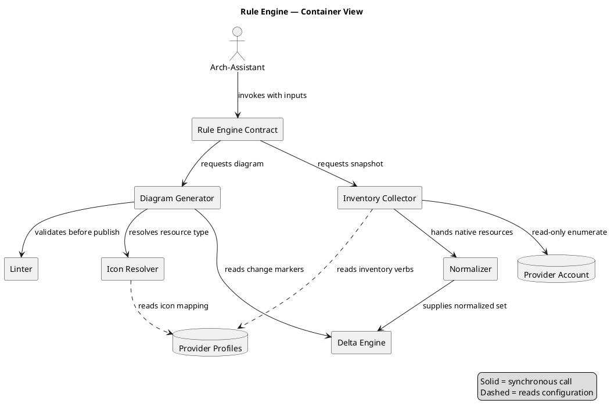
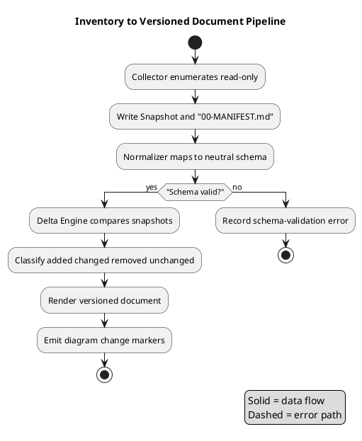
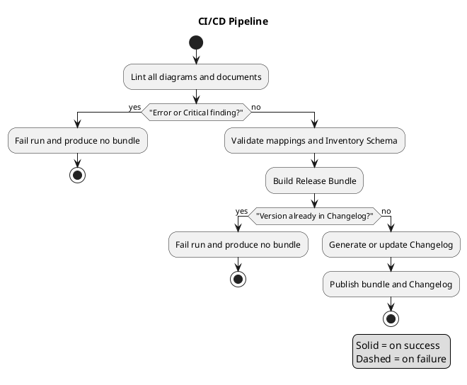

# Design Document

## Overview

This document specifies the design for the **Diagram & Inventory Rule Engine**, a reusable, cloud-agnostic Kiro project that codifies how AI agents deterministically produce two classes of output across five provider profiles (`aws`, `azure`, `gcp`, `oci`, `generic`):

1. **Architecture diagrams** — draw.io `.drawio` files paired with PlantUML or Mermaid source and a Markdown Companion Document.
2. **Inventory documents** — a read-only resource snapshot that is normalized to a neutral schema, compared against a previous snapshot to compute a delta, and rendered as a versioned Markdown document.

### Purpose and Scope

The Rule Engine is not an application that runs in production; it is a **packaged set of rules, mappings, schemas, and reference artifacts** that an AI agent (a Kiro Quick assistant or an AgentCore Arch-Assistant) follows to generate consistent, review-passing artifacts. The engine's value is determinism: given the same inputs, any conforming agent produces byte-comparable diagrams and inventory documents that pass the same lint ruleset.

Scope covers: diagram generation rules, icon/shape resolution, read-only inventory collection contracts, normalization to one schema, delta computation and versioning, multi-cloud composition, quality gates (linting), document frontmatter/formatting, packaging/CI/CD, the Rule Engine invocation contract, and Kiro automation (steering, hooks, property-based tests).

Out of scope: provisioning or mutating cloud resources, live monitoring, and any write operation against a provider account.

### The Two Output Classes

| Output Class | Artifacts | Primary Consumer |
| --- | --- | --- |
| Diagrams | `NN-topic.drawio`, `NN-topic.drawio.png`, `NN-topic.diagram.md` | Architects, KB readers |
| Inventory Docs | Snapshot folder (`00-MANIFEST.md` + per-service JSON), versioned `NN-existing-infrastructure.md` | Platform engineers, analysts |

### The Five Provider Profiles

Each Provider Profile is a configuration set (terminology mapping, icon mapping, container conventions, brand palette, read-only inventory verbs). The provider-neutral core consumes exactly one profile per invocation. The `generic` profile is vendor-neutral (grayscale, no vendor icons) and serves as the fallback and the reference for adding new providers.

### How an Arch-Assistant Consumes the Engine

An Arch-Assistant invokes the **Rule Engine Contract** (see Section 10) with `provider`, `boundary_id`, `region`, `previous_doc_path`, and `inventory_snapshot_path`. The steering documents under `.kiro/steering/` are always-on, so every agent turn inherits the diagram, inventory, frontmatter, and lint rules without an explicit fetch. Hooks run the Linter and schema validation automatically on file save and on task completion.

## Architecture

### Provider-Neutral Core + Per-Provider Profile Abstraction

The engine separates a **provider-neutral core** (the seven components below) from **per-provider profiles**. The core never hard-codes provider terminology, icons, or verbs; it reads them from the profile selected at invocation. This is what allows a new provider to be added by data (a profile row, an icon mapping, verbs, a golden example) rather than by code.

Components (from the requirements Glossary):

- **Diagram Generator** — produces `.drawio`, PlantUML/Mermaid source, the raster export, and the Companion Document; applies lane layout, node limits, quoting, legend, and title-cell encoding.
- **Icon Resolver** — maps a Normalized Resource Type + Provider to a draw.io style string and brand color; sources everything from the profile's authoritative asset pack; never emits placeholders.
- **Inventory Collector** — executes only read-only enumeration verbs declared in the profile; writes the Snapshot and Manifest; enforces secret-safety and non-fatal per-service failures.
- **Normalizer** — transforms native resources into Normalized Resources conforming to the Inventory Schema; computes an order-independent `config_digest`.
- **Delta Engine** — matches resources across snapshots on the identity tuple; classifies each as added/changed/removed/unchanged; feeds both the versioned document and diagram Change Markers.
- **Linter** — evaluates diagrams and documents against `diagram-lint.md`; assigns CRITICAL/ERROR/WARNING; reports publication eligibility.
- **Rule Engine Contract** — the invocation boundary that validates inputs, orchestrates the components, and returns the output artifact set.

### Container View (C4-style)



The container view holds 11 nodes (within the ≤12-node rule), labels every edge, quotes multi-word node names, and includes a legend.

### Inventory Pipeline View



This flow holds 9 nodes, labels branch edges, quotes names containing punctuation, and includes a legend.

## Components and Interfaces

This section formalizes the seven provider-neutral core components introduced in Architecture. For each component it states its responsibility, its inputs, and its outputs/interface (a concise interface signature or method list). The Rule Engine Contract inputs and outputs are formalized here and elaborated in the Rule Engine Contract section.

### Diagram Generator

- **Responsibility:** Produces `.drawio`, PlantUML/Mermaid source, the raster export, and the Companion Document; applies lane layout, node limits, quoting, legend, and title-cell encoding.
- **Inputs:** `provider`, resolved node set (Normalized Resources), Delta Change Markers, target render context (for the PlantUML vs Mermaid decision).
- **Outputs / Interface:**
  - `generate_diagram(provider, nodes, change_markers, render_target) -> { drawio, drawio_png, diagram_md }`
  - On failure returns a generation error naming the diagram and the missing file; excludes the partial diagram from publication.

### Icon Resolver

- **Responsibility:** Maps a Normalized Resource Type + Provider to a draw.io style string and brand color, sourced from the profile's authoritative asset pack; never emits placeholders.
- **Inputs:** `resource_type`, `provider` (reads the provider's icon mapping from the profile).
- **Outputs / Interface:**
  - `resolve_icon(resource_type, provider) -> { style_string, brand_hex, icon_source }`
  - `resolve_container(kind, provider) -> { style_string }` where `kind ∈ { boundary, network_boundary }`, returning exactly one style per kind.
  - On an unmapped type returns an unresolved-type error, emits no style string and no placeholder, and leaves the input unchanged.

### Inventory Collector

- **Responsibility:** Executes only read-only enumeration verbs declared in the profile; writes the Snapshot and Manifest; enforces secret-safety and non-fatal per-service failures.
- **Inputs:** `provider`, `boundary_id`, `region` (reads read-only verbs and cost endpoint from the profile).
- **Outputs / Interface:**
  - `collect(provider, boundary_id, region) -> { snapshot_folder, manifest }`
  - Writes one JSON file per service domain and one subfolder per resource; records secret-free metadata only.
  - On a single service enumeration failure records the failed service and reason and continues with the remaining services.

### Normalizer

- **Responsibility:** Transforms native resources into Normalized Resources conforming to the Inventory Schema; computes an order-independent `config_digest`.
- **Inputs:** native provider resources, the Inventory Schema, the profile's terminology/type mapping.
- **Outputs / Interface:**
  - `normalize(native_resource, provider) -> NormalizedResource` (schema-conforming, with `config_digest`).
  - `compute_config_digest(config) -> hex64` (deterministic, order-independent SHA-256).
  - Unmapped types, missing mandatory fields, and schema-validation failures are recorded as errors and the offending resource is excluded.

### Delta Engine

- **Responsibility:** Matches resources across snapshots on the identity tuple; classifies each as added/changed/removed/unchanged; feeds both the versioned document and diagram Change Markers.
- **Inputs:** current Snapshot (Normalized Resources), previous Snapshot (optional).
- **Outputs / Interface:**
  - `compute_delta(current_snapshot, previous_snapshot?) -> [ DeltaRecord ]` where each `DeltaRecord` carries the identity tuple, one classification from `{ added, changed, removed, unchanged }`, and a change marker.
  - With no previous snapshot every current resource is classified `added`; a missing/malformed snapshot yields a snapshot-input error and no classification.

### Linter

- **Responsibility:** Evaluates diagrams and documents against `diagram-lint.md`; assigns CRITICAL/ERROR/WARNING; reports publication eligibility.
- **Inputs:** a diagram or document artifact, the lint ruleset (`diagram-lint.md`).
- **Outputs / Interface:**
  - `lint(artifact) -> { findings: [ { rule, severity } ], eligible_for_publication: bool }` where eligibility is true only with zero CRITICAL and zero ERROR findings.
  - If the ruleset is missing/unreadable, returns a ruleset-unavailable error and blocks every artifact.

### Rule Engine Contract

- **Responsibility:** The invocation boundary that validates inputs, orchestrates the components, and returns the output artifact set.
- **Inputs** (all required): `provider` (one of `aws`, `azure`, `gcp`, `oci`, `generic`), `boundary_id`, `region`, `previous_doc_path`, `inventory_snapshot_path`.
- **Outputs / Interface:**
  - `invoke({ provider, boundary_id, region, previous_doc_path, inventory_snapshot_path }) -> { drawio, drawio_png, diagram_md, existing_infrastructure_md }` producing `NN-topic.drawio`, `NN-topic.drawio.png`, `NN-topic.diagram.md`, and the versioned `NN-existing-infrastructure.md`.
  - If any required input is missing or `provider` is outside the enumeration, rejects the invocation, produces no output documents, and returns an error naming the missing or invalid input.

See the Rule Engine Contract section for the full input/output tables and validation semantics.

## Repository / Package Layout

The Rule Engine is distributed as a single Kiro project with this concrete tree:

```
Cloud_Architecture/
├── README.md                      # purpose, contents, quick start, links
├── INSTALL.md                     # prerequisites + ordered install/activate steps
├── CHANGELOG.md                   # per-version added/changed/removed, reverse chronological
├── LICENSE
├── .gitlab-ci.yml                 # CI Pipeline definition (lint→validate→bundle→changelog→publish)
├── .kiro/
│   ├── steering/
│   │   ├── diagram-standards.md   # lane order, node limit, quoting, legend, title cell
│   │   ├── inventory-standards.md # read-only verbs, snapshot layout, secret-safety
│   │   ├── provider-profiles.md   # terminology table + profile conventions per provider
│   │   ├── kb-frontmatter.md      # required frontmatter keys, formatting bounds
│   │   └── diagram-lint.md        # lint ruleset + severities
│   ├── hooks/
│   │   ├── lint-on-save.kiro.hook       # PostFileSave, matcher \.(drawio|md)$
│   │   └── validate-on-task.kiro.hook   # PostTaskExec, lint + schema validation
│   └── specs/
│       ├── multicloud-diagram-inventory/
│       │   ├── requirements.md
│       │   ├── design.md
│       │   ├── tasks.md
│       │   └── .config.kiro
│       └── _template/
│           ├── requirements.md
│           ├── design.md
│           └── tasks.md
├── mappings/
│   ├── aws-icons.yaml
│   ├── azure-icons.yaml
│   ├── gcp-icons.yaml
│   ├── oci-icons.yaml
│   └── generic-icons.yaml
├── schemas/
│   └── inventory.schema.json      # Normalized Resource JSON Schema
└── examples/
    ├── aws/       # Golden Example (passes all CRITICAL/ERROR lint rules)
    ├── azure/
    ├── gcp/
    ├── oci/
    └── generic/
```

This layout satisfies the reusability constraints of Requirement 9 (steering docs, spec docs, mappings per provider, schema, one golden example per provider, spec template) and Requirement 10 (README, INSTALL, CHANGELOG, CI definition under version control).

## Data Models

### 4a. Provider Profile Schema

Each Provider Profile carries a **terminology normalization table**. Every profile defines a row for each of the nine neutral terms (Requirement 9 AC10). A row structure is:

```yaml
term: object_store          # neutral concept key
label: "Object Store"       # human label
providers:
  aws:     { native: "S3 Bucket",            resource_type: object_store }
  azure:   { native: "Storage Account/Blob", resource_type: object_store }
  gcp:     { native: "Cloud Storage Bucket", resource_type: object_store }
  oci:     { native: "Object Storage Bucket",resource_type: object_store }
  generic: { native: "Object Store",         resource_type: object_store }
```

The neutral-concept → per-provider mapping for the nine terms:

| Neutral concept | aws | azure | gcp | oci | generic |
| --- | --- | --- | --- | --- | --- |
| Boundary | Account | Subscription | Project | Tenancy/Compartment | Environment |
| Network Boundary | VPC | VNet | VPC | VCN | Network |
| serverless function | Lambda | Functions | Cloud Functions | Functions | Function |
| object store | S3 | Blob Storage | Cloud Storage | Object Storage | Object Store |
| managed SQL | RDS | Azure SQL DB | Cloud SQL | Autonomous/DB Systems | Managed SQL |
| message queue | SQS | Service Bus/Queue | Pub/Sub | Streaming/Queue | Message Queue |
| secrets store | Secrets Manager | Key Vault | Secret Manager | Vault | Secrets Store |
| managed Kubernetes | EKS | AKS | GKE | OKE | Managed Kubernetes |
| LLM platform | Bedrock | Azure OpenAI | Vertex AI | OCI Generative AI | LLM Platform |

### 4b. Icon Mapping Data Model

`mappings/<provider>-icons.yaml` maps a logical resource type to an icon id/file, a brand hex color, and a complete draw.io style string. It also declares container/group styles for the Boundary and the Network Boundary, plus the authoritative asset pack and, for non-AWS providers, the icon reference source (`custom` unpacked library vs `builtin`).

```yaml
provider: aws
asset_pack: "mxgraph.aws4 (draw.io built-in, AWS 2019+)"
icon_source: builtin
resources:
  object_store:
    icon_id: mxgraph.aws4.s3
    brand_hex: "#7AA116"
    style: "shape=mxgraph.aws4.resourceIcon;resIcon=mxgraph.aws4.s3;fillColor=#7AA116;strokeColor=#ffffff;aspect=fixed;html=1;fontSize=11;verticalLabelPosition=bottom;verticalAlign=top;align=center"
containers:
  boundary:
    style: "shape=mxgraph.aws4.group;grIcon=mxgraph.aws4.group_account;..."
  network_boundary:
    style: "shape=mxgraph.aws4.group;grIcon=mxgraph.aws4.group_vpc;..."
```

One concrete example row per provider:

- **aws** — uses the AWS 2019+ `mxgraph.aws4.*` library. The exact style-string pattern for S3 is:
  `shape=mxgraph.aws4.resourceIcon;resIcon=mxgraph.aws4.s3;fillColor=#7AA116;strokeColor=#ffffff;aspect=fixed;html=1;fontSize=11;verticalLabelPosition=bottom;verticalAlign=top;align=center`
- **azure** — `object_store` → `Storage Account`, `brand_hex: "#0078D4"`, `icon_source: custom` (draw.io shape library imported from unpacked Azure icon assets); the row records the custom library shape reference.
- **gcp** — `object_store` → `Cloud Storage`, `brand_hex: "#4285F4"`, `icon_source: custom` (unpacked GCP icon library) or `builtin` where a built-in GCP shape exists; the row declares exactly one of the two.
- **oci** — `object_store` → `Object Storage`, `brand_hex: "#F80000"`, `icon_source: custom` (unpacked OCI icon library); the row declares the source explicitly.
- **generic** — `object_store` → neutral rectangle. Style uses only grayscale, no vendor icon:
  `rounded=0;whiteSpace=wrap;html=1;fillColor=#FFFFFF;strokeColor=#000000`

The Icon Resolver returns exactly one Boundary container style and exactly one Network Boundary container style per provider (Requirement 2 AC6).

### 4c. Normalized Resource / Inventory Schema

`schemas/inventory.schema.json` (JSON Schema, Draft 2020-12) defines the Normalized Resource:

```json
{
  "$schema": "https://json-schema.org/draft/2020-12/schema",
  "$id": "https://rule-engine/schemas/inventory.schema.json",
  "title": "Normalized Resource",
  "type": "object",
  "required": ["provider","resource_type","native_type","id","name","boundary","region","tags","config_digest"],
  "additionalProperties": false,
  "properties": {
    "provider":     { "enum": ["aws","azure","gcp","oci","generic"] },
    "resource_type":{ "enum": ["boundary","network_boundary","serverless_fn","object_store","managed_sql","message_queue","secrets_store","managed_k8s","llm_platform"] },
    "native_type":  { "type": "string", "minLength": 1 },
    "id":           { "type": "string" },
    "name":         { "type": "string", "minLength": 1 },
    "boundary":     { "type": "string", "minLength": 1 },
    "region":       { "type": "string", "minLength": 1 },
    "tags":         { "type": "object", "additionalProperties": { "type": "string" } },
    "config_digest":{ "type": "string", "pattern": "^[a-f0-9]{64}$" }
  }
}
```

**config_digest computation (order-independent):** the Normalizer canonicalizes the resource configuration before hashing:
1. Drop any excluded/secret fields (never included, per secret-safety).
2. Recursively sort object keys lexicographically and sort array elements by their canonical serialization so that element ordering does not affect the result.
3. Serialize the canonical form to UTF-8 JSON with no insignificant whitespace.
4. Compute SHA-256 over the canonical bytes; `config_digest` is the 64-char lowercase hex digest.

Two configurations that are equal as sets/maps (independent of key or element ordering) therefore produce identical digests (Requirement 4 AC4).

### 4d. Snapshot Folder Layout and Manifest

Snapshot folder name (Requirement 3 AC4):
`inventory-<provider>-<boundary-id>-<region>-<YYYY-MM-DD_HHMM>` where the timestamp is the UTC collection start.

```
inventory-aws-123456789012-us-east-1-2025-01-15_1430/
├── 00-MANIFEST.md
├── compute.json            # one JSON file per service domain
├── storage.json
├── network.json
└── resources/
    ├── s3-my-bucket/       # one subfolder per enumerated resource
    └── lambda-my-fn/
```

`00-MANIFEST.md` field structure (all non-empty, Requirement 3 AC6):

| Field | Description |
| --- | --- |
| provider | Provider enum value |
| boundary_id | Boundary identifier enumerated |
| region_set | Regions covered by the snapshot |
| caller_identity | Read-only identity that performed collection |
| tool_versions | CLI/SDK versions used |
| file_count | Total file count of the snapshot folder |
| delta_instructions | Instructions for the next session to compute the delta |

### 4e. Delta Record Model

```json
{
  "identity": { "provider": "aws", "resource_type": "object_store", "identity_key": "my-bucket" },
  "classification": "changed",
  "change_marker": "🔄",
  "prev_config_digest": "…",
  "curr_config_digest": "…"
}
```

- **Identity tuple** (Requirement 5 AC1): `(provider, resource_type, identity)` where `identity` = `id` when present, otherwise `name`.
- **Classification** (exhaustive, mutually exclusive): `added | changed | removed | unchanged`.
- **Change marker**: 🆕 added, 🔄 changed, red styling removed/blocked, none for unchanged.

## Diagram Generation Pipeline

The Diagram Generator produces the mandatory triple for every diagram named `NN-topic`: `NN-topic.drawio`, `NN-topic.drawio.png`, and `NN-topic.diagram.md` (Requirement 1 AC10). If any required output cannot be produced, it returns a generation error naming the diagram and the missing file and excludes the partial diagram from publication (Requirement 1 AC12).

### Icon Resolution and Layout

1. For each resource node, the Diagram Generator calls the Icon Resolver with `(resource_type, provider)`; the resolver returns a draw.io style string and a `#RRGGBB` brand color sourced from the profile's authoritative asset pack. An unresolved type produces an error and no placeholder (Requirement 2 AC8).
2. Nodes are placed into left-to-right lanes in the fixed order: **actors → edge → router → asynchronous messaging → workers → platform core → data → on-premises** (Requirement 1 AC11).
3. Boundary and Network Boundary containers use the provider's group styles.

### Title Cell and Legend

Every diagram title cell encodes (Requirement 5 AC9):
`<provider> <workload> — <boundary id> / <region> | <date> | vN`
where `<date>` is `YYYY-MM-DD` and `vN` is `v` + a positive integer. Change Marker descriptions use ISO 8601 dates only, no relative time (Requirement 5 AC10).

Mandatory Legend block (Requirement 5 AC11): solid line = primary flow; dashed line = async/event-driven; red = blocked/missing/disabled; 🆕 = new in version N; 🔄 = changed in version N; dashed green boundary = stack boundary; dashed blue boundary = Network Boundary.

### PlantUML vs Mermaid Decision Matrix

| Diagram type | Render target | Source |
| --- | --- | --- |
| C4 / architecture / component / deployment | any | PlantUML (AC1) |
| sequence / flow / state | GitLab Markdown or Backstage TechDocs | Mermaid permitted (AC2) |
| sequence / flow / state | any other target | PlantUML (AC3) |

All PlantUML uses a single `@startuml`/`@enduml` pair and excludes preprocessor directives (Requirement 1 AC9). Node names with spaces or non-`[A-Za-z0-9_-]` characters are double-quoted (AC6); every edge carries a non-empty label (AC7); raster images carry non-empty alt text (AC8).

## Inventory & Delta Pipeline

### Read-Only Collection Contract (per provider)

The Inventory Collector executes only read-only enumeration verbs explicitly listed in the profile (Requirement 3 AC1–AC3); the count of state-mutating verbs per run is zero.

| Provider | Read-only verbs |
| --- | --- |
| aws | `list*`, `describe*`, `get*` |
| azure | `az … list`, `az … show` |
| gcp | `gcloud … list`, `gcloud … describe` |
| oci | `oci … list`, `oci … get` |
| generic | manual entry / Terraform-state import |

### Collection Behavior

- Write the Snapshot folder and `00-MANIFEST.md`; write one JSON file per service domain and one subfolder per resource (Requirement 3 AC5, AC7).
- **Secret-safety:** record resource metadata only; never write secret values, key material, or SecureString values into any Snapshot file (Requirement 3 AC8).
- **Non-fatal per-service failures:** on a single service enumeration failure, record the failed service and reason and continue with the remaining services (Requirement 3 AC9).
- Cost/billing data uses only the profile's declared cost endpoint (Requirement 3 AC10).

### Normalization and Delta

The Normalizer maps each native resource to a Normalized Resource, computing the order-independent `config_digest` (Section 4c). Unmapped types, missing mandatory fields, and schema-validation failures are recorded as errors and the offending resource is excluded (Requirement 4 AC5–AC7). The Delta Engine then classifies each resource and supplies the classification to both the versioned Markdown document and the diagram Change Markers (Requirement 5 AC8). With no previous snapshot, every current resource is classified `added` (Requirement 5 AC6). A missing/malformed snapshot yields a snapshot-input error and no classification (Requirement 5 AC7).

## Quality Gates / Linter Design

The Linter evaluates every diagram and document against `diagram-lint.md`, assigning each finding CRITICAL, ERROR, or WARNING (Requirement 7 AC1). A diagram/document with zero CRITICAL and zero ERROR findings is **eligible for publication**; otherwise it is **blocked** (Requirement 7 AC2–AC3). If the ruleset is missing/unreadable, the Linter returns a ruleset-unavailable error and blocks everything (Requirement 7 AC14).

### Lint Rule → Requirement → Severity Table

| Rule | Condition | Severity | Source |
| --- | --- | --- | --- |
| node-count | > 12 nodes | ERROR | R7 AC4 / R1 AC4 |
| edge-label | edge has no non-empty label | WARNING | R7 AC5 / R1 AC7 |
| node-quote | special-char node name not quoted | ERROR | R7 AC6 / R1 AC6 |
| legend-present | diagram has no Legend | ERROR | R7 AC7 / R5 AC11 |
| companion-doc | `.drawio` without `.diagram.md` | ERROR | R7 AC8 / R1 AC10 |
| frontmatter | missing/empty required frontmatter key | CRITICAL | R7 AC9 / R8 |
| icon-resolved | placeholder icon instead of resolved icon | ERROR | R7 AC10 / R2 AC8 |
| secret-safety | snapshot file contains secret/key/SecureString | CRITICAL | R7 AC11 / R3 AC8 |
| title-versioned | title cell missing version or date | WARNING | R7 AC12 / R5 AC9 |
| mermaid-type | Mermaid used for non sequence/flow/state | WARNING | R7 AC13 / R1 AC2 |

### Invocation

The Linter is invoked three ways: **CLI** (developer runs it locally), **Hook** (PostFileSave on `.drawio`/`.md`, and PostTaskExec), and **CI** (the pipeline runs it against every artifact). When a hook action fails with a blocking result, the failure reason is surfaced to the agent session (Requirement 11 AC4).

## Kiro Integration (Lessons Applied)

### Steering — Always On

Every steering document under `.kiro/steering/` is configured with `inclusion: always` (the default), so `diagram-standards.md`, `inventory-standards.md`, `provider-profiles.md`, `kb-frontmatter.md`, and `diagram-lint.md` are injected into every agent turn within the workspace (Requirement 11 AC1). This is the mechanism that makes the rules deterministic: an agent never has to remember to load them.

### Hooks

Two hooks live under `.kiro/hooks/`. The first runs the Linter whenever a `.drawio` or Markdown file is saved (Requirement 11 AC2). The second runs the Linter and schema validation after a spec task completes (Requirement 11 AC3). A blocking hook failure surfaces its reason to the session (Requirement 11 AC4).

`lint-on-save.kiro.hook`:

```json
{
  "version": "v1",
  "hooks": [
    {
      "name": "Lint on save",
      "trigger": "PostFileSave",
      "matcher": "\\.(drawio|md)$",
      "action": {
        "type": "command",
        "command": "rule-engine-lint --file \"$KIRO_FILE_PATH\" --fail-on error,critical"
      }
    }
  ]
}
```

`validate-on-task.kiro.hook`:

```json
{
  "version": "v1",
  "hooks": [
    {
      "name": "Validate on task completion",
      "trigger": "PostTaskExec",
      "action": {
        "type": "command",
        "command": "rule-engine-lint --all --fail-on error,critical && rule-engine-validate-schema --schema schemas/inventory.schema.json --targets 'examples/**/*.json'"
      }
    }
  ]
}
```

### Property-Based Testing

PBT is applicable to the three pure/logic components — Icon Resolver, Normalizer, and Delta Engine — because each has clear input/output behavior and universal properties over a large input space. PBT is **IDE-only** (generated during design; run in the workspace, not in production) and each property is derived from an acceptance criterion and traceable back to it (Requirement 11 AC5, AC8). The properties below are consolidated after redundancy reflection (schema-conformance folds AC4.2/4.3/4.7 into one; the delta partition folds AC5.1–5.5 into one partition property plus one marker property).

## Correctness Properties

*A property is a characteristic or behavior that should hold true across all valid executions of a system — essentially, a formal statement about what the system should do. Properties serve as the bridge between human-readable specifications and machine-verifiable correctness guarantees.*

### Icon Resolver

### Property 1: Resolve is total over the mapped domain

*For any* Provider and Normalized Resource Type present in that provider's icon mapping, the Icon Resolver returns a non-empty draw.io style string and a brand color (never an error).

**Validates: Requirements 2.1**

### Property 2: Brand color is always #RRGGBB

*For any* successful resolution, the returned brand color matches the pattern `^#[0-9A-Fa-f]{6}$` (a single `#` followed by exactly six hexadecimal digits).

**Validates: Requirements 2.2**

### Property 3: AWS style strings use the aws4 resource-icon form

*For any* mapped Normalized Resource Type resolved for provider `aws`, the returned style string contains the prefix `shape=mxgraph.aws4.resourceIcon;resIcon=mxgraph.aws4.`.

**Validates: Requirements 2.3**

### Property 4: Non-AWS icon source is exactly one of two values

*For any* mapped Normalized Resource Type resolved for provider `azure`, `gcp`, or `oci`, the returned icon reference source is exactly one of `custom` or `builtin`.

**Validates: Requirements 2.5**

### Property 5: Exactly one container style per boundary and per network boundary

*For any* Provider, the Icon Resolver returns exactly one concrete container group style for that provider's Boundary and exactly one concrete container group style for that provider's Network Boundary.

**Validates: Requirements 2.6**

### Property 6: Generic profile is grayscale and vendor-icon-free

*For any* mapped Normalized Resource Type resolved for provider `generic`, the returned style contains no vendor icon token and every fill and stroke color is grayscale (equal red, green, and blue components).

**Validates: Requirements 2.7**

### Property 7: Unresolved types never yield a placeholder

*For any* (Normalized Resource Type, Provider) pair absent from the mapped domain, the Icon Resolver returns an unresolved-type error, emits no style string and no placeholder icon, and leaves the input unchanged.

**Validates: Requirements 2.8**

### Property 8: Icon and color provenance

*For any* successful resolution, the returned icon identifier and brand color are members of the authoritative asset pack declared for that Provider Profile.

**Validates: Requirements 2.9**

### Normalizer

### Property 9: Every emitted resource validates against the schema

*For any* native provider resource that maps to a Normalized Resource Type, the emitted Normalized Resource conforms to `inventory.schema.json`, including all required fields populated and a `resource_type` drawn from the neutral enum.

**Validates: Requirements 4.1, 4.2, 4.3, 4.7**

### Property 10: config_digest is deterministic and order-independent

*For any* resource configuration, computing `config_digest` twice yields the same value, and any permutation of object keys or reordering of array elements yields an identical `config_digest`.

**Validates: Requirements 4.4**

### Property 11: Unmapped resources are excluded with an error

*For any* native provider resource with no defined Normalized Resource Type mapping, the Normalizer excludes the resource from the normalized output and records an unmapped-type error.

**Validates: Requirements 4.5**

### Property 12: Missing mandatory field excludes the resource with an error

*For any* native provider resource lacking a value required for a mandatory Inventory Schema field, the Normalizer excludes the resource and records a missing-field error identifying the resource and the missing field.

**Validates: Requirements 4.6**

### Delta Engine

### Property 13: Classification partitions the identity set

*For any* pair of a current and a previous Snapshot, every resource identity in the union of both snapshots receives exactly one classification from {added, changed, removed, unchanged}; the four classification sets are pairwise disjoint and their union equals the full identity set (exhaustive and mutually exclusive), where identity is `id` when present and `name` otherwise.

**Validates: Requirements 5.1, 5.2, 5.3, 5.4, 5.5**

### Property 14: Change markers match classification

*For any* classified resource, the change marker is 🆕 when added, 🔄 when changed, red styling when removed, and no marker when unchanged.

**Validates: Requirements 5.2, 5.3, 5.4**

### Property 15: No previous snapshot implies all added

*For any* current Snapshot compared with no previous Snapshot, the Delta Engine classifies every resource in the current Snapshot as added.

**Validates: Requirements 5.6**

## Error Handling

Every component follows a **fail-safe, publication-excluding** discipline: on a fault the component returns a typed error that names the affected artifact, produces no partial output for that artifact, and leaves inputs unchanged.

| Component | Error | Behavior |
| --- | --- | --- |
| Diagram Generator | generation error | names diagram + missing file; excludes partial diagram (R1 AC12) |
| Diagram Generator | profile-convention error | names provider + missing boundary style; excludes diagram (R6 AC5) |
| Diagram Generator | frontmatter/formatting rejection | names offending key/constraint; does not emit to KB (R8 AC9–AC10) |
| Icon Resolver | unresolved-type error | no placeholder, no style; input unchanged (R2 AC8) |
| Icon Resolver | asset-source error | names profile; no icon/color/placeholder; input unchanged (R2 AC10) |
| Inventory Collector | per-service failure | records service + reason; continues remaining services (R3 AC9) |
| Normalizer | unmapped-type / missing-field / schema-validation | records error; excludes resource (R4 AC5–AC7) |
| Delta Engine | snapshot-input error | names snapshot; produces no classification (R5 AC7) |
| Linter | ruleset-unavailable error | blocks every artifact from publication (R7 AC14) |
| Rule Engine Contract | invalid-input error | rejects invocation; no output documents (R9 AC7) |
| CI Pipeline | lint failure / duplicate version | fails run; produces no Release Bundle (R10 AC3, AC7) |

## Testing Strategy

The strategy combines property-based tests, example/unit tests, and integration tests.

**Property-based tests** cover the 15 Correctness Properties above (Icon Resolver, Normalizer, Delta Engine). Configuration:
- A mature property-based testing library for the implementation language is used; the properties are **not** implemented from scratch.
- Each property test runs a minimum of **100 iterations**.
- Each property test is tagged with a comment referencing its design property, using the format: **Feature: multicloud-diagram-inventory, Property {number}: {property_text}**.
- Each Correctness Property is implemented by a single property-based test.

**Example / unit tests** cover the fixed, enumerated, or representative cases identified in prework:
- AWS container group styles (R2 AC4) — assert each expected `mxgraph.aws4.group` value.
- One Golden Example Normalized Resource per provider validates against the schema (R4 AC8).
- Frontmatter and formatting bounds (R8) — representative accept/reject documents.
- Lint severity outcomes (R7) — one artifact per rule producing the expected severity.

**Integration / edge-case tests** cover wiring and error conditions not suited to PBT:
- Delta classification reaches both the versioned document and diagram markers (R5 AC8).
- Asset-pack-missing (R2 AC10) and malformed-snapshot (R5 AC7) error paths.
- Hook invocation surfaces blocking failures to the session (R11 AC4).
- CI pipeline fail conditions (R10 AC3, AC7).

## CI/CD & Distribution Design

The CI Pipeline definition (`.gitlab-ci.yml`) is stored under version control (Requirement 10 AC1).

### Pipeline Stages



This flow holds 10 nodes, labels branch edges, quotes decision names, and includes a legend.

| Stage | Action | Fail condition |
| --- | --- | --- |
| lint | run Linter on every diagram + document | ≥1 ERROR or CRITICAL (R10 AC3) |
| validate | validate each `mappings/<provider>-icons.yaml` + Inventory Schema | invalid mapping/schema (R10 AC2) |
| build | package Release Bundle | — |
| changelog | generate/update `CHANGELOG.md`, reverse chronological | duplicate Semantic Version (R10 AC7) |
| publish | publish Release Bundle + Changelog as artifacts | — |

### Versioning and Release Bundle

Every Release Bundle is named with a Semantic Version `MAJOR.MINOR.PATCH` (Requirement 10 AC5). The Changelog records per-version added/changed/removed items in reverse chronological order (Requirement 10 AC6). The Release Bundle contains the steering documents, the mapping files, the Inventory Schema, the examples, and the "add a new provider" runbook (Requirement 10 AC4). On a successful release run, the bundle and updated Changelog are published as artifacts (Requirement 10 AC10).

## Rule Engine Contract

The contract is the single invocation boundary for an Arch-Assistant.

**Inputs** (all required, Requirement 9 AC6):

| Input | Description |
| --- | --- |
| `provider` | one of `aws`, `azure`, `gcp`, `oci`, `generic` |
| `boundary_id` | Boundary identifier (Account/Subscription/Project/Tenancy/Environment) |
| `region` | target region |
| `previous_doc_path` | path to the previous versioned document (for delta) |
| `inventory_snapshot_path` | path to the current inventory snapshot |

**Outputs** (Requirement 9 AC8):

- `NN-topic.drawio`
- `NN-topic.drawio.png`
- `NN-topic.diagram.md`
- versioned `NN-existing-infrastructure.md` with Frontmatter, where `NN` is a two-digit zero-padded sequence in `01`–`99`.

**Input validation / rejection** (Requirement 9 AC7): if any required input is missing, or `provider` is outside the enumeration, the contract rejects the invocation, produces no output documents, and returns an error naming the missing or invalid input.

## Extensibility / Add-a-Provider Runbook

The ordered steps referenced by Requirement 9 AC9 (a lint run reporting zero violations is the completion gate):

1. **Add a Provider Profile row** — add a terminology normalization row for the new provider covering all nine neutral terms in `provider-profiles.md`.
2. **Add an icon mapping** — create `mappings/<provider>-icons.yaml` with logical resource type → icon id/file → brand hex → draw.io style, plus Boundary and Network Boundary container styles, and declare the authoritative asset pack and icon source.
3. **Add inventory verbs** — declare the provider's read-only enumeration verbs and cost endpoint in the profile.
4. **Add a Golden Example** — add one reference artifact under `examples/<provider>/` that passes every CRITICAL and ERROR lint rule.
5. **Complete a lint run** — run the Linter and confirm it reports zero lint violations.

## Requirements Traceability

| Design section / component | Requirements satisfied |
| --- | --- |
| Diagram Generation Pipeline | R1 (all AC), R5 AC9–AC11, R6 |
| Icon Resolver (Architecture, Data Model 4b, Properties 1–8) | R2 (all AC) |
| Inventory & Delta Pipeline (collection contract) | R3 (all AC) |
| Data Model 4c (schema), Normalizer, Properties 9–12 | R4 (all AC) |
| Data Model 4e (delta), Delta Engine, Properties 13–15 | R5 (all AC) |
| Multi-cloud composition (Architecture, Diagram Pipeline) | R6 (all AC) |
| Quality Gates / Linter Design | R7 (all AC) |
| Diagram Pipeline title/legend + KB emission rules | R8 (all AC) |
| Repository / Package Layout, Rule Engine Contract, Add-a-Provider Runbook, Data Model 4a | R9 (all AC) |
| CI/CD & Distribution Design, Repository Layout (README/INSTALL/CHANGELOG/CI) | R10 (all AC) |
| Kiro Integration (steering, hooks, PBT), Correctness Properties | R11 (all AC) |
