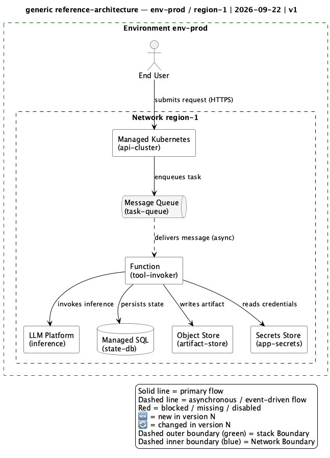
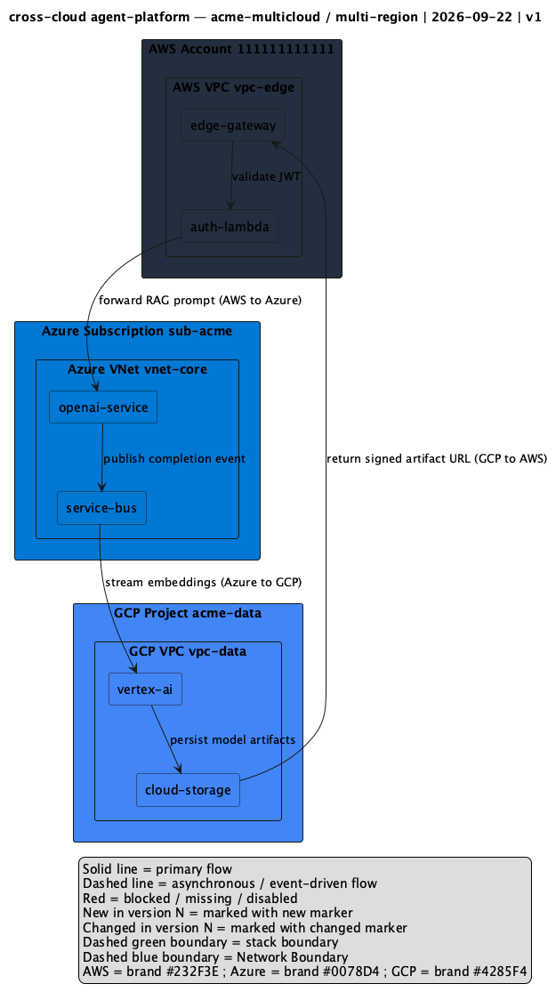

# Diagram & Inventory Rule Engine

A reusable, cloud-agnostic Kiro project that codifies how AI agents deterministically
produce architecture diagrams and inventory documents across five provider profiles:
`aws`, `azure`, `gcp`, `oci`, and a vendor-neutral `generic` fallback.

## Purpose

The Rule Engine is a packaged set of rules, mappings, schemas, and reference artifacts
that an AI agent follows to generate consistent, review-passing artifacts. Its value is
determinism: given the same inputs, any conforming agent produces comparable diagrams and
inventory documents that pass the same lint ruleset.

The engine separates a **provider-neutral core** (Linter, Icon Resolver, Inventory
Collector, Normalizer, Delta Engine) from **per-provider profiles**. Terminology, icons,
brand colors, container conventions, and read-only inventory verbs all come from the
profile selected at invocation — never from hard-coded core logic. A new provider is
added by data (a profile row, an icon mapping, verbs, and a golden example), not by
changing core code.

## Contents

- `.kiro/steering/` — always-on standards that govern every agent turn:
  - [`diagram-standards.md`](.kiro/steering/diagram-standards.md) — lane order, 12-node
    limit, node quoting, edge labels, title cell, legend, PlantUML/Mermaid matrix, and the
    `.drawio` / `.drawio.png` / `.diagram.md` artifact triple
  - [`inventory-standards.md`](.kiro/steering/inventory-standards.md) — read-only verbs,
    zero-mutation rule, snapshot folder layout, manifest fields, and secret-safety
  - [`provider-profiles.md`](.kiro/steering/provider-profiles.md) — the nine-concept
    terminology normalization table, container conventions, brand palette, and verb lists
  - [`kb-frontmatter.md`](.kiro/steering/kb-frontmatter.md) — required frontmatter keys,
    document-length and section bounds, and accept/reject behavior for KB documents
  - [`diagram-lint.md`](.kiro/steering/diagram-lint.md) — the authoritative lint ruleset,
    severities (CRITICAL / ERROR / WARNING), and publication eligibility
  - [`asset-packs.md`](.kiro/steering/asset-packs.md) — official provider icon-pack
    sources, layouts, and the built-in → official-asset → unresolved icon fallback order
- `.kiro/hooks/` — `lint-on-save` and `validate-on-task` automation
- `.kiro/specs/` — the spec for this engine plus a reusable spec template under `_template/`
- `mappings/` — per-provider icon/shape mapping files (`<provider>-icons.yaml`)
- `schemas/` — the Normalized Resource JSON Schema (`inventory.schema.json`)
- `examples/` — one golden example per provider (`aws`, `azure`, `gcp`, `oci`, `generic`)
- `src/rule_engine/` — the provider-neutral core components and CLI entry points

## Example diagrams

One golden example per provider ships under `examples/`, each as the full artifact triple
(`.drawio`/`.puml` source, exported `.png`, and a `.diagram.md` companion). All follow the
same layout standard: uniform 78×78 icons, fixed lane order, a dashed-green stack boundary
and dashed-blue Network Boundary, numbered flow markers with a right-side Flow legend, and
the standard Legend block.

### AWS — agent platform

Built-in `mxgraph.aws4.*` icons; EKS → SQS → Lambda → Bedrock/RDS/S3/Secrets Manager.


### Azure — OpenAI RAG


### GCP — Vertex pipeline

Official Google Cloud 2025 icons (Core Product + Product Category, by file path); API
Gateway → Load Balancer → Vertex AI with Pub/Sub, GKE, Cloud SQL, Cloud Storage, and
Secret Manager inside a VPC.


### OCI — Generative AI stack

OCI ships no built-in draw.io library, so each node embeds the official OCI stencil glyph
(caption stripped, scaled square) from the OCI draw.io pack.


### Generic — vendor-neutral reference (PlantUML)

Grayscale, no vendor icons — the fallback profile and the reference used when adding a new
provider.



### Cross-cloud composition (PlantUML C4)

A C4 container diagram spanning more than one provider, with every cross-provider edge
labeled by the data flow it represents.



## Quick start

Install the engine (editable) into your environment:

```bash
pip install -e .
```

This exposes two console scripts used by the Kiro hooks and the CI pipeline:

- `rule-engine-lint` — run the lint ruleset over diagrams and Markdown documents
- `rule-engine-validate-schema` — validate normalized resources against the schema

Lint every artifact in the workspace and fail on any ERROR or CRITICAL finding:

```bash
rule-engine-lint --all --fail-on error,critical
```

Lint a single file (the same invocation the `lint-on-save` hook uses):

```bash
rule-engine-lint --file examples/aws/01-aws-agent-platform.drawio --fail-on error,critical
```

Validate the example normalized resources against the schema:

```bash
rule-engine-validate-schema --schema schemas/inventory.schema.json --targets 'examples/**/*.json'
```

The five steering documents in `.kiro/steering/` are always on, so once the project is
open in a Kiro workspace every agent turn inherits the diagram, inventory, profile,
frontmatter, and lint rules automatically.

## Links

- [Installation Guide](INSTALL.md) — prerequisites and ordered install/activate steps
- [Add a New Provider Runbook](docs/add-a-provider.md) — ordered steps to extend the engine with a new provider
- [Changelog](CHANGELOG.md) — per-version added / changed / removed history
- Steering documents:
  [diagram-standards](.kiro/steering/diagram-standards.md),
  [inventory-standards](.kiro/steering/inventory-standards.md),
  [provider-profiles](.kiro/steering/provider-profiles.md),
  [kb-frontmatter](.kiro/steering/kb-frontmatter.md),
  [diagram-lint](.kiro/steering/diagram-lint.md)
