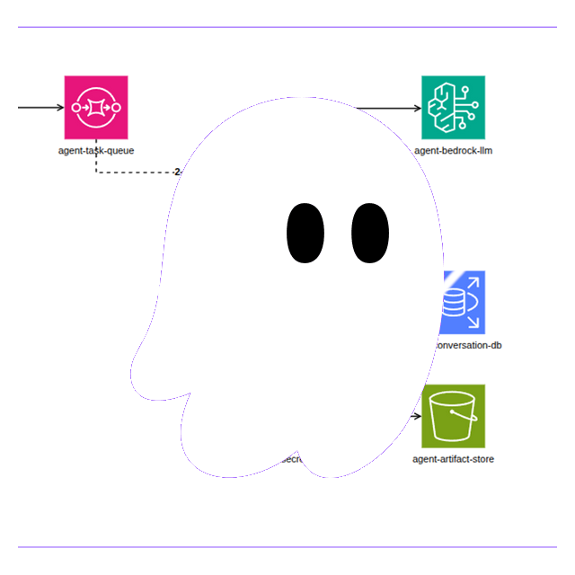
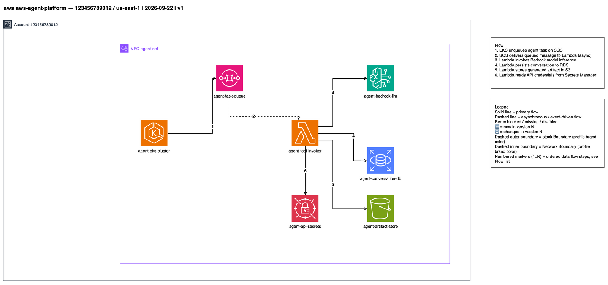
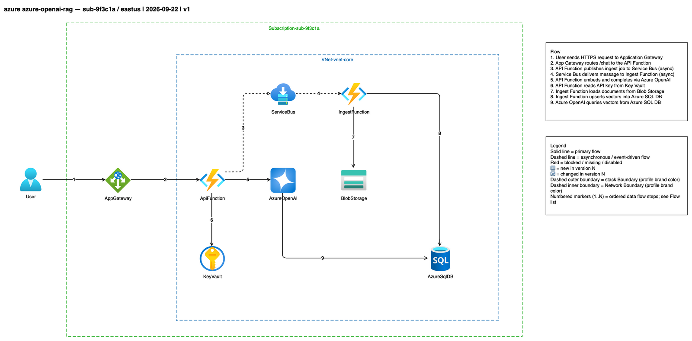
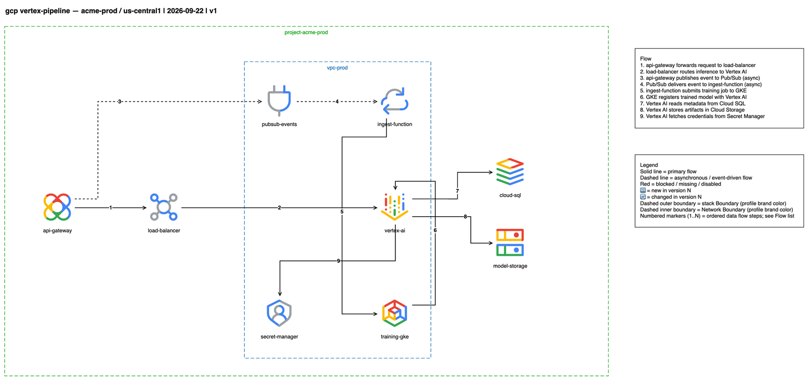
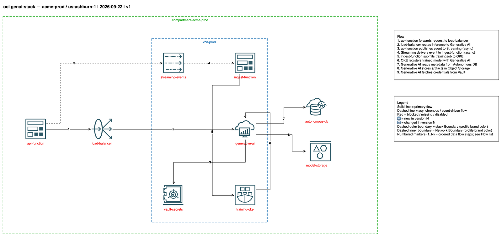

<p align="center">
  
</p>

# Diagram & Inventory Rule Engine

A reusable, cloud-agnostic Kiro project that codifies how AI agents deterministically
produce architecture diagrams and inventory documents across five provider profiles:
`aws`, `azure`, `gcp`, `oci`, and a vendor-neutral `generic` fallback.

## Purpose

The Rule Engine is a packaged set of rules, mappings, schemas, and reference artifacts
that an AI agent follows to generate consistent, review-passing artifacts. Its value is
determinism: given the same inputs, any conforming agent produces comparable diagrams and
inventory documents that pass the same lint ruleset.

The engine separates a **provider-neutral core** (Linter, Icon Resolver, Inventory
Collector, Normalizer, Delta Engine) from **per-provider profiles**. Terminology, icons,
brand colors, container conventions, and read-only inventory verbs all come from the
profile selected at invocation — never from hard-coded core logic. A new provider is
added by data (a profile row, an icon mapping, verbs, and a golden example), not by
changing core code.

Since **1.3.0** the engine is first-class at two diagram scales via a diagram **class**:

- a **`flow`** summary — a narrative ≤ 12-node view ("how does a request move end-to-end?");
- a **`landscape`** as-built — a complete inventory view on one canvas ("what is deployed,
  and how does it all relate at once?"), with a relaxed node cap but tighter, geometry-
  enforced layout rules.

A large system ships as the **sanctioned pair**: one `flow` summary cross-linked to one
`landscape` as-built of the same system. Icons are **standardised on the official vendor
bundles** and resolved through a committed index (`mappings/icon-index.json`) built at
install time, so every node renders the correct provider glyph — not a look-alike.

## Contents

- `.kiro/steering/` — always-on standards that govern every agent turn:
  - [`diagram-standards.md`](.kiro/steering/diagram-standards.md) — lane order, 12-node
    limit, node quoting, edge labels, title cell, legend, PlantUML/Mermaid matrix, and the
    `.drawio` / `.drawio.png` / `.diagram.md` artifact triple
  - [`inventory-standards.md`](.kiro/steering/inventory-standards.md) — read-only verbs,
    zero-mutation rule, snapshot folder layout, manifest fields, and secret-safety
  - [`provider-profiles.md`](.kiro/steering/provider-profiles.md) — the nine-concept
    terminology normalization table, container conventions, brand palette, and verb lists
  - [`kb-frontmatter.md`](.kiro/steering/kb-frontmatter.md) — required frontmatter keys,
    document-length and section bounds, and accept/reject behavior for KB documents
  - [`diagram-lint.md`](.kiro/steering/diagram-lint.md) — the authoritative lint ruleset,
    severities (CRITICAL / ERROR / WARNING), and publication eligibility
  - [`asset-packs.md`](.kiro/steering/asset-packs.md) — official provider icon-pack
    sources, layouts, and the built-in → official-asset → unresolved icon fallback order
- `.kiro/hooks/` — `lint-on-save` and `validate-on-task` automation
- `.kiro/agents/` — three purpose-built custom agents (`diagram-author`,
  `inventory-collector`, `rule-engine-reviewer`) with least-privilege tool/permission scopes
- `.kiro/skills/rule-engine-artifacts/` — the on-demand artifact-generation skill
- `powers/rule-engine-artifacts/` — the skill + AWS-docs MCP packaged as a Kiro power
- `.kiro/specs/` — the spec for this engine plus a reusable spec template under `_template/`
- `mappings/` — per-provider icon/shape mapping files (`<provider>-icons.yaml`), the
  diagram-role table (`roles.yaml`), and the committed icon index built from the official
  packs (`icon-index.json`, plus the `aws4-icons.json` / `azure2-shapes.json` allow-lists)
- `schemas/` — the Normalized Resource JSON Schema (`inventory.schema.json`)
- `examples/` — golden examples per provider: an **application-flow** diagram plus a
  cross-linked **HA multi-region** `flow` summary + `landscape` as-built pair (see table below)
- `scripts/` — the diagram generators (`build_*_ha_example.py`, `ha_multiregion_common.py`),
  the icon-set builder (`build_icon_sets.py`), the asset fetcher, and the raster exporter
- `src/rule_engine/` — the provider-neutral core components and CLI entry points

## Example diagrams

Every example ships as the full artifact triple (`.drawio` source, exported `.drawio.png`,
and a `.diagram.md` companion) and follows one layout standard: uniform 78×78 icons, fixed
lane order, dashed outer/inner boundaries in the profile brand color, numbered flow markers
with a right-side Flow legend, the standard Legend block, and geometry-enforced routing.

### By cloud × diagram type

Each cloud ships three diagrams: an **application-flow** view (`01`), and the sanctioned
**HA multi-region** pair — a `flow` **summary** (≤ 12 nodes) cross-linked to a `landscape`
**as-built** (~34 nodes) of the *same* active-passive system. The application-flow and
summary export at ≤ 1600px; the landscape exports wide (≤ 3600px) so every node stays
legible. Icons are the provider's official glyphs, resolved through `mappings/icon-index.json`.

| Cloud | Application flow (`01`) | HA summary (`flow`) | HA as-built (`landscape`) |
| --- | --- | --- | --- |
| **AWS** | [agent platform](examples/aws/01-aws-agent-platform.drawio) · [png](examples/aws/01-aws-agent-platform.drawio.png) | [summary](examples/aws/02-aws-ha-multiregion-summary.drawio) · [png](examples/aws/02-aws-ha-multiregion-summary.drawio.png) | [landscape](examples/aws/02-aws-ha-multiregion-landscape.drawio) · [png](examples/aws/02-aws-ha-multiregion-landscape.drawio.png) |
| **Azure** | [OpenAI RAG](examples/azure/01-azure-openai-rag.drawio) · [png](examples/azure/01-azure-openai-rag.drawio.png) | [summary](examples/azure/02-azure-ha-multiregion-summary.drawio) · [png](examples/azure/02-azure-ha-multiregion-summary.drawio.png) | [landscape](examples/azure/02-azure-ha-multiregion-landscape.drawio) · [png](examples/azure/02-azure-ha-multiregion-landscape.drawio.png) |
| **GCP** | [Vertex pipeline](examples/gcp/01-gcp-vertex-pipeline.drawio) · [png](examples/gcp/01-gcp-vertex-pipeline.drawio.png) | [summary](examples/gcp/02-gcp-ha-multiregion-summary.drawio) · [png](examples/gcp/02-gcp-ha-multiregion-summary.drawio.png) | [landscape](examples/gcp/02-gcp-ha-multiregion-landscape.drawio) · [png](examples/gcp/02-gcp-ha-multiregion-landscape.drawio.png) |
| **OCI** | [GenAI stack](examples/oci/01-oci-genai-stack.drawio) · [png](examples/oci/01-oci-genai-stack.drawio.png) | [summary](examples/oci/02-oci-ha-multiregion-summary.drawio) · [png](examples/oci/02-oci-ha-multiregion-summary.drawio.png) | [landscape](examples/oci/02-oci-ha-multiregion-landscape.drawio) · [png](examples/oci/02-oci-ha-multiregion-landscape.drawio.png) |
| **generic** | [reference (PlantUML)](examples/generic/generic-reference-architecture.puml) · [png](examples/generic/generic-reference-architecture.png) | — | — |
| **cross-cloud** | [C4 composition (PlantUML)](examples/cross-cloud/cross-cloud-composition.puml) · [png](examples/cross-cloud/cross-cloud-composition.png) | — | — |

Icon mechanism per cloud: **AWS** built-in `mxgraph.aws4.*` stencils; **Azure** azure2
file-path image shapes (`img/lib/azure2/*`); **GCP** official 2025 icons by file path
(product-first, category-fallback — Cloud CDN uses the Networking category icon, as Google's
own docs do); **OCI** embedded stencils from the official draw.io pack; **generic** grayscale
base shapes.

### Application-flow previews

One application-flow diagram per cloud, each in the provider's own icon set — visually
distinct at a glance.

#### AWS — agent platform

Built-in `mxgraph.aws4.*` icons; EKS → SQS → Lambda → Bedrock/RDS/S3/Secrets Manager.



#### Azure — OpenAI RAG

azure2 image shapes; Application Gateway → Functions, Service Bus to the ingest Function,
Azure OpenAI with Key Vault, Blob Storage, and Azure SQL DB inside a VNet.



#### GCP — Vertex pipeline

Official Google Cloud 2025 icons (product-first, category-fallback); API Gateway → Load
Balancer → Vertex AI with Pub/Sub, GKE, Cloud SQL, Cloud Storage, and Secret Manager.



#### OCI — Generative AI stack

Embedded official OCI stencils; Functions → Load Balancer → Generative AI with Streaming,
OKE, Autonomous DB, Object Storage, and Vault inside a VCN.



## Quick start

Install the engine (editable) into your environment:

```bash
pip install -e .
```

This exposes the console scripts used by the Kiro hooks and the CI pipeline:

- `rule-engine-lint` — run the lint ruleset over diagrams and Markdown documents
- `rule-engine-validate-schema` — validate normalized resources against the schema
- `rule-engine-build-icon-sets` — fetch the official icon packs and build the committed
  `mappings/icon-index.json` (run at install time; `--check` verifies it is current)
- `rule-engine-verify-icon` — resolve every icon reference in a `.drawio` against its
  authoritative source (aws4 ids, azure2 paths, GCP asset paths, OCI slugs)
- `rule-engine-check-rasters` — enforce the class-aware exported-PNG budget
- `rule-engine-check-snapshot` — enforce the inventory Snapshot folder shape
  (folder name, the seven manifest fields, one JSON per service domain, one
  subfolder per enumerated resource)
- `rule-engine-index-assets` / `rule-engine-check-asset-paths` — asset indexing / path guard

Lint every artifact in the workspace and fail on any ERROR or CRITICAL finding:

```bash
rule-engine-lint --all --fail-on error,critical
```

Lint a single file (the same invocation the `lint-on-save` hook uses):

```bash
rule-engine-lint --file examples/aws/01-aws-agent-platform.drawio --fail-on error,critical
```

Validate the example normalized resources against the schema:

```bash
rule-engine-validate-schema --schema schemas/inventory.schema.json --targets 'examples/**/*.json'
```

The six steering documents in `.kiro/steering/` are always on, so once the project is
open in a Kiro workspace every agent turn inherits the diagram, inventory, profile,
frontmatter, lint, and asset-pack rules automatically.

## Custom agents, skill, and power

Beyond the always-on steering, the workspace ships purpose-built Kiro configurations:

- `.kiro/agents/` — three **custom agents**, each a least-privilege, per-workflow
  configuration: [`diagram-author`](.kiro/agents/diagram-author.md) (authors/regenerates
  diagrams and runs the gate), [`inventory-collector`](.kiro/agents/inventory-collector.md)
  (strictly read-only collection — the `inventory-standards` zero-mutation contract encoded
  as permissions), and [`rule-engine-reviewer`](.kiro/agents/rule-engine-reviewer.md)
  (read-only verification gate).
- `.kiro/skills/rule-engine-artifacts/SKILL.md` — the on-demand **skill** with the
  artifact-generation workflow and the exact gate commands.
- `powers/rule-engine-artifacts/` — the same skill + the read-only AWS-docs MCP server
  packaged as a shareable **Kiro power** (`plugin.json`).

See [Kiro University compliance](docs/KIRO-UNIVERSITY-COMPLIANCE.md) for how each maps to a
lesson.

## Community

Contributions are welcome. Before you start, please read:

- [Contributing Guide](CONTRIBUTING.md) — dev setup, the checks that gate every change, and how to add a provider
- [Code of Conduct](CODE_OF_CONDUCT.md) — the Contributor Covenant we follow
- [Security Policy](SECURITY.md) — how to report a vulnerability privately
- [License](LICENSE) — MIT

Open a [bug report or feature request](https://github.com/totoshko88/Cloud_Architecture/issues/new/choose),
and send changes as a pull request using the
[PR template](.github/PULL_REQUEST_TEMPLATE.md).

## Links

- [Installation Guide](INSTALL.md) — prerequisites and ordered install/activate steps
- [Kiro University compliance](docs/KIRO-UNIVERSITY-COMPLIANCE.md) — spec, steering, hooks, tests, skill, MCP, custom agents, and the packaged power mapped to each lesson
- [Add a New Provider Runbook](docs/add-a-provider.md) — ordered steps to extend the engine with a new provider
- [Diagram Design Notes](docs/DIAGRAM-DESIGN-NOTES.md) — the rationale behind the routing, icon-fidelity, and layout rules
- [Architecture](docs/ARCHITECTURE.md) — data model, components, and the two output pipelines
- [Changelog](CHANGELOG.md) — per-version added / changed / removed history
- Steering documents:
  [diagram-standards](.kiro/steering/diagram-standards.md),
  [inventory-standards](.kiro/steering/inventory-standards.md),
  [provider-profiles](.kiro/steering/provider-profiles.md),
  [kb-frontmatter](.kiro/steering/kb-frontmatter.md),
  [diagram-lint](.kiro/steering/diagram-lint.md)
