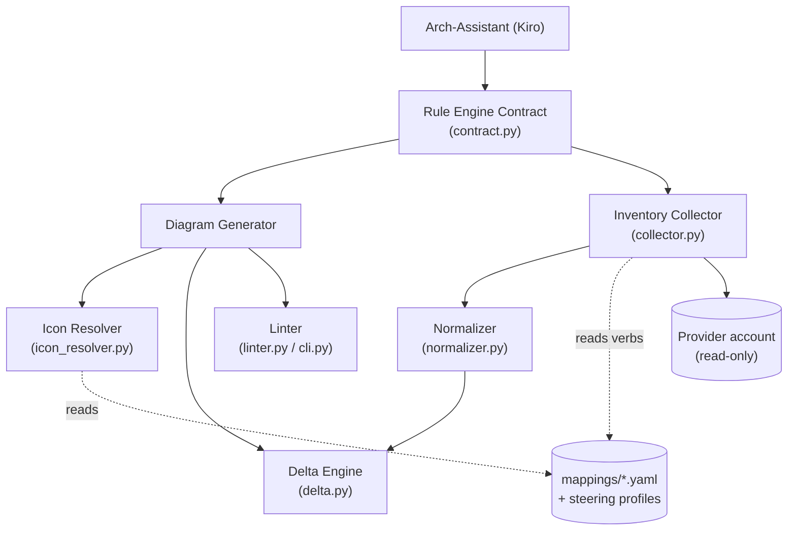

# Diagram & Inventory Rule Engine — Architecture & Algorithm

A structured, end-to-end description of what this project is, how it is built,
and the exact logic each component follows. It is written to be read on its own:
after reading it you should understand the data model, the seven core
components, the two output pipelines, and the quality gates that decide whether
an artifact may be published.

> This is a hand-authored project document (not an engine-generated KB
> document), so the `kb-frontmatter` 12-key contract does not apply to it.

---

## 1. What this project is

The Rule Engine is **not a running application**. It is a *packaged set of rules,
mappings, schemas, and reference artifacts* that an AI agent (a Kiro assistant)
follows to deterministically produce two classes of output for multi-cloud
environments:

1. **Architecture diagrams** — a draw.io `.drawio` source, its exported
   `.drawio.png` raster, and a Markdown companion document.
2. **Inventory documents** — a read-only resource snapshot that is normalized to
   one neutral schema, compared against a previous snapshot to compute a delta,
   and rendered as a versioned Markdown document.

The core value is **determinism**: given the same inputs, any conforming agent
produces artifacts that pass the same lint ruleset. The engine is provider-neutral
at its core and reads everything provider-specific from a **profile** selected at
invocation, so a new cloud is added *by data* (a profile row, an icon mapping,
read-only verbs, a golden example) rather than by changing core code.

**Out of scope:** provisioning or mutating cloud resources, live monitoring, and
any write operation against a provider account. Inventory collection is strictly
read-only.

### Supported provider profiles

`aws`, `azure`, `gcp`, `oci`, and a vendor-neutral `generic` profile (grayscale,
no vendor icons) that is both the fallback and the reference used when adding a
new provider.

---

## 2. Repository map

| Path | Role |
| --- | --- |
| `.kiro/steering/*.md` | Six always-on rule documents (the authoritative standards) |
| `.kiro/specs/multicloud-diagram-inventory/` | The spec: `requirements.md`, `design.md`, `tasks.md` |
| `.kiro/hooks/*.hook` | Automation: lint-on-save, validate-on-task |
| `.kiro/skills/rule-engine-artifacts/` | The artifact-authoring skill (how-to workflow) |
| `.kiro/settings/mcp.json` | Optional MCP server registration (AWS docs) |
| `src/rule_engine/` | The provider-neutral core (Python) |
| `mappings/<provider>-icons.yaml` | Per-provider icon/shape + container mappings |
| `schemas/inventory.schema.json` | The Normalized Resource JSON Schema |
| `examples/<provider>/` | One golden example per provider + cross-cloud C4 |
| `docs/add-a-provider.md` | The "add a new provider" runbook |
| `tests/` | Unit + property-based tests |

---

## 3. The data model

Everything the engine reasons about reduces to a small neutral vocabulary.

### Nine neutral resource types

`boundary`, `network_boundary`, `serverless_fn`, `object_store`, `managed_sql`,
`message_queue`, `secrets_store`, `managed_k8s`, `llm_platform`. Each profile
maps these to native service names (e.g. `serverless_fn` → AWS Lambda / Azure
Functions / GCP Cloud Functions / OCI Functions).

### Normalized Resource

A single resource in the neutral schema (`schemas/inventory.schema.json`) with
fields: `provider`, `resource_type`, `native_type`, `id`, `name`, `boundary`,
`region`, `tags`, `config_digest`. The `config_digest` is an order-independent
hash used to detect configuration changes between snapshots.

### Structural containers

Two per profile: the **Boundary** (Account / Subscription / Project / Tenancy /
Environment) and the **Network Boundary** (VPC / VNet / VPC / VCN / Network).

---

## 4. Architecture: neutral core + profiles

The engine separates a **provider-neutral core** from **per-provider profiles**.
The core never hard-codes provider terminology, icons, or verbs; it reads them
from the profile selected at invocation.



### The seven core components

| Component | Module | Responsibility |
| --- | --- | --- |
| Rule Engine Contract | `contract.py` | Validate inputs, orchestrate components, return the artifact set (or a blocking error) |
| Diagram Generator | `contract.py` + `diagram_layout.py` | Render `.drawio`, apply lane layout, node cap, legend, title cell, companion doc |
| Icon Resolver | `icon_resolver.py` | Map a neutral type + provider to a draw.io style string and brand hex; never emit a placeholder |
| Inventory Collector | `collector.py` | Run only read-only enumeration verbs; write the Snapshot + Manifest; enforce secret-safety |
| Normalizer | `normalizer.py` | Transform native resources to Normalized Resources; compute the `config_digest` |
| Delta Engine | `delta.py` | Match resources across snapshots on identity; classify added / changed / removed / unchanged |
| Linter | `linter.py`, `cli.py`, `geometry.py` | Evaluate diagrams + documents against `diagram-lint.md`; assign severity; report eligibility |

Supporting modules: `constants.py` (single source of the neutral vocabulary),
`schema.py` + `validate_schema_cli.py` (schema validation), `version_guard.py`
(duplicate-version guard), `asset_index.py` (official-asset fallback),
`asset_paths_guard.py` (icon file-path existence), `raster_gate.py` (PNG export
budget).

---

## 5. Algorithm: the diagram pipeline

Given `provider`, `boundary_id`, `region`, and an optional inventory snapshot:

1. **Validate inputs** — `validate_inputs()` rejects an unknown provider or a
   malformed input with a `ContractInputError` naming the offending field.
2. **Resolve nodes** — for each resource, call `resolve_icon(resource_type,
   provider)`. Resolution order (see `asset-packs.md`): (1) built-in stencil,
   (2) official asset file (SVG/PNG by file path), else (3) fail-honest
   *unresolved* — never a placeholder. For GCP specifically the order is
   official **product** icon → official **category** icon → `mxgraph.gcp2.*`.
3. **Lay out** — place nodes on the shared grid (`diagram_layout.py`: 78×78
   icons, column step 220, row step 160, grid step 10) in the fixed lane order
   `actors → edge → router → async messaging → workers → platform core → data →
   on-premises`. Cap at **12 nodes** (split + index beyond that).
4. **Wire edges** — orthogonal routing, entries left/top and exits right/bottom,
   numbered flow markers whose prose moves to a right-side `Flow` legend.
5. **Render the triple** — write `NN-topic.drawio`, export
   `NN-topic.drawio.png`, and generate `NN-topic.diagram.md`.
6. **Lint before returning** — the contract lints the diagram and the document;
   a CRITICAL or ERROR finding raises `ContractGenerationError` and the partial
   artifact is excluded from publication (fail-closed).

### Raster export detail

The committed `.drawio` references image-shape icons by **file path** (lint-clean;
a `data:` URI would trip `icon-resolved`). The headless draw.io CLI cannot load
local files, so `scripts/export_raster.py` inlines `assets/vendor/*` icons as
base64 in a **temporary copy** before export, keeping the source lint-clean and
the raster within the D7 budget (≤ 1200px wide, < 500KB, white background).

---

## 6. Algorithm: the inventory pipeline

1. **Collect (read-only)** — the Collector runs only the enumeration verbs the
   profile declares (`list*` / `describe*` / `get*` for AWS, etc.). The count of
   state-mutating verbs per run is **zero**. A single service failure is
   recorded and enumeration continues (non-fatal).
2. **Write the Snapshot** — folder
   `inventory-<provider>-<boundary-id>-<region>-<YYYY-MM-DD_HHMM>` with one JSON
   per service domain, a per-resource subfolder under `resources/`, and a
   `00-MANIFEST.md` recording provider, boundary, region set, caller identity,
   tool versions, file count, and delta instructions. **Secret-safety:** secret
   values, key material, and SecureString contents are dropped before writing.
3. **Normalize** — `normalize()` maps each native resource to the neutral schema
   and computes an order-independent `config_digest`; unmapped types are
   excluded with an error rather than guessed.
4. **Compute delta** — `compute_delta(current, previous)` matches on the
   identity tuple and classifies each resource as added (🆕), changed (🔄),
   removed (red), or unchanged. The classification partitions the identity set.
5. **Render** — a versioned Markdown document carries the delta and drives the
   diagram Change Markers.

---

## 7. Quality gates (the single publication decision)

An artifact is **eligible for publication only with zero CRITICAL and zero ERROR
findings**; WARNING findings do not block. Gates:

| Gate | Command | Blocks on |
| --- | --- | --- |
| Linter | `rule-engine-lint --all --fail-on error,critical` | any CRITICAL/ERROR (e.g. `frontmatter`, `node-count`, `icon-resolved`, `secret-safety`) |
| Schema | `rule-engine-validate-schema` | a resource that violates `inventory.schema.json` |
| Asset paths | `rule-engine-check-asset-paths` | a mapping icon file path / OCI slug that does not exist |
| Raster budget | `rule-engine-check-rasters` | a PNG over 1200px wide or ≥ 500KB |
| Tests | `pytest -q` | any failing unit or property-based test |

The ruleset in `diagram-lint.md` is authoritative and **fail-closed**: if that
file is missing, every artifact is reported blocked (`ruleset-unavailable`).

---

## 8. Determinism, CI, and versioning

- **Steering is always-on**, so every agent turn inherits the diagram, inventory,
  frontmatter, and lint rules without an explicit fetch.
- **Hooks** run the Linter on file save (`lint-on-save`) and the Linter + schema
  validation on task completion (`validate-on-task`).
- **CI** (`.gitlab-ci.yml`, `.github/workflows/ci.yml`) lints every artifact,
  validates the schema and mappings, fetches the official icon packs to verify
  file-path icons, runs the raster gate, and runs the full test suite. On a tag
  it guards against a duplicate Semantic Version, packages the Release Bundle,
  updates the Changelog, and publishes — in that order, fail-closed.

---

## 9. MCP support (optional research aid)

Authoring accurate AWS artifacts sometimes needs current AWS facts (service
names, limits, doc links). The project registers the **AWS Documentation MCP
server** so the agent can look these up instead of relying on memory. It exposes
read-only tools (`search_documentation`, `read_documentation`, `recommend`).

Registration lives in `.kiro/settings/mcp.json`. If that workspace file is not
present (its directory is access-controlled in some setups), add the same block
to the user-level `~/.kiro/settings/mcp.json`:

```json
{
  "mcpServers": {
    "aws-docs": {
      "command": "uvx",
      "args": ["awslabs.aws-documentation-mcp-server@latest"],
      "env": { "FASTMCP_LOG_LEVEL": "ERROR" },
      "disabled": false,
      "autoApprove": ["search_documentation", "read_documentation", "recommend"]
    }
  }
}
```

`uvx` (from the `uv` toolchain) downloads and runs the server on demand; no
manual install step is required. The server is a third-party tool subject to its
own terms — it is read-only and used here only for documentation lookups.

---

## 10. See also

- `.kiro/specs/multicloud-diagram-inventory/requirements.md` — EARS requirements.
- `.kiro/specs/multicloud-diagram-inventory/design.md` — full design narrative.
- `.kiro/steering/` — the six authoritative rule documents.
- `docs/add-a-provider.md` — the ordered runbook for adding a new provider.
- `docs/KIRO-UNIVERSITY-COMPLIANCE.md` — how this project exercises each Kiro feature.
